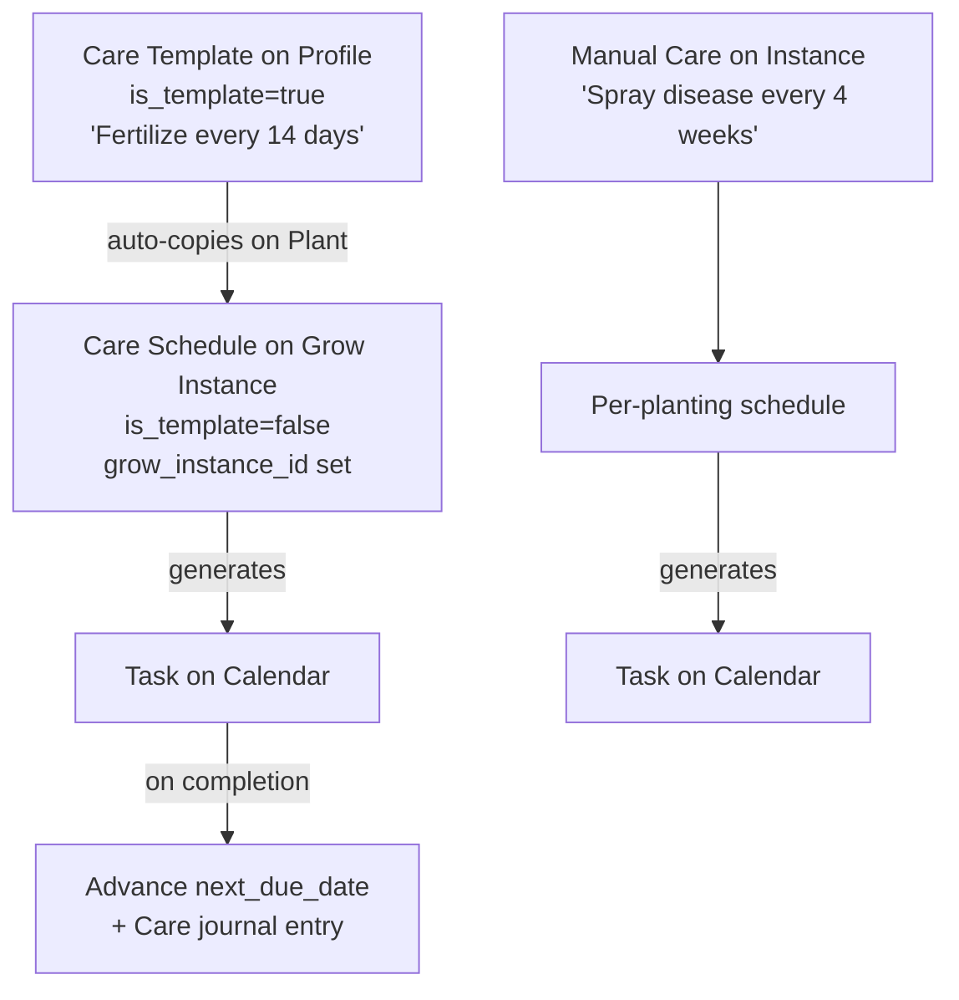
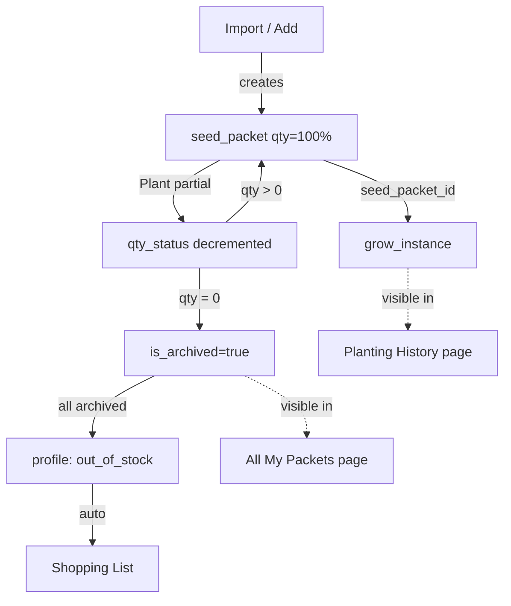
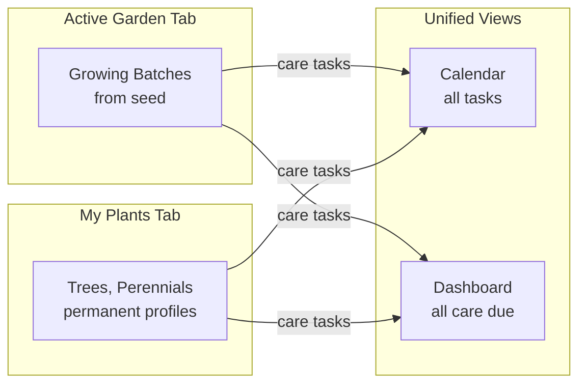

# Seed Vault: Definitive Implementation Blueprint

## What Exists Today

**Tech stack:** Next.js 14 (App Router) + Supabase + Tailwind CSS + Gemini AI + Tesseract OCR

**Working features:**

- Seed vault with grid/list/active views, search, status/tag/type filters
- Link import with Gemini scraping, hero image search, global cache
- Photo import with Gemini extraction (two flows: camera capture and file upload)
- Plant profiles with seed packets, grow instances
- Tasks/calendar, journal entries with photos and weather snapshots
- Shopping list, schedule defaults ("Brain"), QR scanning
- Auth + RLS multi-tenant, global plant cache

**Critical bugs and gaps (19 total):**

1. `completeSowTask` DELETES entire packet rows; Plant page correctly decrements `qty_status` -- these contradict
2. No direct link from `grow_instances` to the packet(s) used
3. Weather/zone hardcoded to Vista, CA / Zone 10b
4. Photo import doesn't save raw packet photo separately from hero
5. No "All My Packets" or "Planting History" views
6. Profile page has flat care info, missing edit fields, legacy clutter, no plantings section
7. Settings page is an unorganized junk drawer
8. Import flow loses ALL progress on tab navigation or cancel; no retry for failed items
9. No explicit journal entry types (inferred from text matching)
10. No harvest weight/quantity tracking or yield stats
11. No "dead" status for grow instances
12. No bulk journaling or quick-tap actions
13. No recurring care tasks for seasonal or permanent plants
14. No permanent plant profiles (trees, perennials)
15. No household/family sharing
16. Image compression only in BatchAddSeed (all other uploads send raw 5-10MB photos)
17. No soft delete/undo
18. No offline/PWA support
19. No data export, frost alerts, or location tracking on plantings

---

## Phase 1: Database and Schema Foundation

Every subsequent phase depends on these columns and tables existing.

### New tables

`**user_settings**` -- zone, location, weather coordinates

```sql
CREATE TABLE user_settings (
  id uuid DEFAULT gen_random_uuid() PRIMARY KEY,
  user_id uuid REFERENCES auth.users NOT NULL UNIQUE,
  planting_zone text,
  last_frost_date date,
  latitude numeric,
  longitude numeric,
  timezone text DEFAULT 'America/Los_Angeles',
  location_name text,
  created_at timestamptz DEFAULT now(),
  updated_at timestamptz DEFAULT now()
);
```

`**care_schedules**` -- recurring care for both seasonal and permanent plants

```sql
CREATE TABLE care_schedules (
  id uuid DEFAULT gen_random_uuid() PRIMARY KEY,
  plant_profile_id uuid REFERENCES plant_profiles ON DELETE CASCADE,
  grow_instance_id uuid REFERENCES grow_instances ON DELETE CASCADE,
  user_id uuid REFERENCES auth.users NOT NULL,
  title text NOT NULL,
  category text NOT NULL DEFAULT 'maintenance',
  recurrence_type text NOT NULL
    CHECK (recurrence_type IN ('interval','monthly','yearly','custom_dates','one_off')),
  interval_days integer,
  months integer[],
  day_of_month integer,
  custom_dates date[],
  next_due_date date,
  last_completed_at timestamptz,
  is_active boolean DEFAULT true,
  is_template boolean DEFAULT false,
  notes text,
  created_at timestamptz DEFAULT now(),
  updated_at timestamptz DEFAULT now()
);
```

Key design: `is_template = true` on profile-level schedules. When you plant, templates auto-copy to the grow instance (`is_template = false`, `grow_instance_id` set). You can also add one-off care to a specific planting (e.g., "spray for disease every 4 weeks").

### Column additions to existing tables

- `**plant_profiles**`: `profile_type text DEFAULT 'seed' CHECK (IN ('seed','permanent'))`, `deleted_at timestamptz`
- `**journal_entries**`: `entry_type text DEFAULT 'note' CHECK (IN ('planting','growth','harvest','note','care','pest','death','quick'))`, `harvest_weight numeric`, `harvest_unit text`, `harvest_quantity numeric`, `deleted_at timestamptz`
- `**grow_instances**`: `location text`, `end_reason text`, `seed_packet_id uuid REFERENCES seed_packets`, `deleted_at timestamptz`; expand status constraint to include `'dead'`
- `**seed_packets**`: `packet_photo_path text`, `deleted_at timestamptz`
- `**tasks**`: `care_schedule_id uuid REFERENCES care_schedules`, `deleted_at timestamptz`

### Shared image compression utility

Extract `resizeImageIfNeeded` from `[src/components/BatchAddSeed.tsx](src/components/BatchAddSeed.tsx)` into `[src/lib/compressImage.ts](src/lib/compressImage.ts)` so all upload paths share the same logic.

### TypeScript types

Update `[src/types/garden.ts](src/types/garden.ts)` / `[src/types/vault.ts](src/types/vault.ts)` with new types: `UserSettings`, `CareSchedule`, and updated interfaces for `PlantProfile`, `JournalEntry`, `GrowInstance`, `SeedPacket`, `Task`.

### Files to create/change

- New: `supabase/migrations/20250211_phase1_schema.sql`
- New: `src/lib/compressImage.ts`
- Edit: `src/types/garden.ts`, `src/types/vault.ts`

---

## Phase 2: Settings Page Redesign + Zone/Weather/Export

### Settings page reorganization

Current `[src/app/settings/page.tsx](src/app/settings/page.tsx)` is 7 unrelated sections with mixed styling. Redesign into grouped categories:

```
Settings
  MY GARDEN
    Planting Zone (dropdown 3a-13b)
    Last Frost Date (date picker)
    Location (name + lat/lng with "Use My Location" button)

  DATA & TOOLS
    Export My Data (JSON/CSV zip download)
    Trash (soft-deleted items, 30-day recovery)
    Import History (renamed from "Import Logs")
    Plant Data Cache (renamed from "Extract Cache")
    Repair Hero Photos

  GARDEN BRAIN
    Schedule Defaults (renamed from "Brain Editor")
    Tag Manager (renamed from "Tag HQ")

  ACCOUNT
    My Household (members, invites -- placeholder until Phase 9)
    Sign Out
```

Each category in a labeled card section. Consistent card styling throughout.

### Dynamic weather

`[src/lib/weatherSnapshot.ts](src/lib/weatherSnapshot.ts)`: Accept optional `{ latitude, longitude, timezone }`, fall back to Vista defaults.

### Frost alerts on dashboard

`[src/app/page.tsx](src/app/page.tsx)`: Check 3-day forecast for lows at or below 32F. Show amber banner if user has active plantings.

### Data export

Settings: "Export My Data" button fetches all user tables, packages as JSON + optional CSV, triggers browser download as zip.

### Dashboard updates

`[src/app/page.tsx](src/app/page.tsx)`: Use `user_settings` for weather location and display name. Replace hardcoded "Vista, CA."

---

## Phase 3: Plant Profile Page Redesign

Full redesign of `[src/app/vault/[id]/page.tsx](src/app/vault/%5Bid%5D/page.tsx)`.

### Current problems

- Flat care info list with no grouping
- Edit modal missing Water and Sowing Depth fields
- "Zone 10b" section hardcoded and shown even when empty
- No plantings history, no yield stats
- Growth Gallery is unlabeled thumbnails
- Legacy vendor details clutter the page
- Only 2 tabs (Overview, Packets)

### New layout

```
Back to Vault
Header: Name - Variety        Status Badge    [Plan] [Plant] [Edit]
Hero Image (16:10, larger, cleaner overlays)
Quick Stats: [Packets: 3] [Plantings: 5] [Yield: 12 lbs]

Tabs: [About] [Packets] [Plantings] [Journal]
      (permanent plants: [About] [Care] [Journal])

ABOUT TAB:
  How to Grow (card):
    Planting: Sowing Method, Window, Spacing, Depth
    Growing: Sun, Water, Germination Days
    Harvest: Days to Maturity
  Tags (badges)
  Care Templates (recurring tasks that auto-copy on planting)
  Description / Growing Notes
  Source URL

PACKETS TAB:
  Packet list: vendor, purchase date, qty bar, packet reference photo
  Add Packet button

PLANTINGS TAB:
  Each grow_instance: sown date, location, status badge,
    packet used, harvest count, end reason
  Expandable: journal entries for that planting

JOURNAL TAB:
  All entries for this profile, chronological
  Entry type badges, photos, weather
```

### Edit modal fixes

Add missing fields: Water, Sowing Depth, Tags, Growing Notes, Status. Remove legacy clutter. Clean up Zone section to use user's actual zone.

---

## Phase 4: Import Resilience + Image Enhancement

### 4a. Progressive saving during link import

`[src/app/vault/import/page.tsx](src/app/vault/import/page.tsx)`:

- Save each successfully processed item to `localStorage` (not sessionStorage) as it completes -- not just at the end
- **"Stop & Review" button**: stops processing, navigates to review with completed items
- After batch: show successes (green checkmark) and failures (red X with error) separately
- **"Retry Failed" button**: re-processes only failed items; successes stay put
- **"Continue to Review" button**: takes only successes to the review page
- Individual retry per failed item

### 4b. Review page persistence

`[src/app/vault/review-import/page.tsx](src/app/vault/review-import/page.tsx)`:

- Switch from `sessionStorage` to `localStorage` so review data survives tab closes
- Show "You have N items pending review" banner on the Vault page if unfinished review data exists
- Clear only after successful "Save All to Vault"

### 4c. Photo import: packet photo separation

- Save raw packet photo to `seed-packets/{user_id}/` as "Packet Reference"
- Search for separate hero image of the plant itself
- If AI can't read variety (confidence < 0.5): inline prompt "We found {vendor}, type the variety name?"

### 4d. Order confirmation scanning

- New option in BatchAddSeed: "Scan Order Confirmation"
- Gemini prompt handles screenshots with multiple line items
- Returns array of items, each enters review flow

---

## Phase 5: Seed Packet Inventory Fix + New Views

### 5a. Fix completeSowTask (critical bug)

`[src/lib/completeSowTask.ts](src/lib/completeSowTask.ts)` currently DELETES entire packet rows. Fix to:

- Open a **Packet Picker Modal** (choose which packet(s), set % to use per packet)
- Decrement `qty_status` using same math as Plant page
- Archive (not delete) when `qty_status` reaches 0
- Save `seed_packet_id` on the resulting `grow_instance`
- Trigger out_of_stock + shopping list when all packets archived

### 5b. Reusable Packet Picker Modal

New `[src/components/PacketPickerModal.tsx](src/components/PacketPickerModal.tsx)`:

- All non-archived packets for the profile, oldest first
- Multi-select checkboxes, per-packet "% to use" slider
- Summary: "Using 50% of Packet 1 + 100% of Packet 2"
- Used by both calendar task completion AND the Plant page

### 5c. Profile page auto-archive

`[src/app/vault/[id]/page.tsx](src/app/vault/%5Bid%5D/page.tsx)`: When qty slider hits 0, auto-set `is_archived: true`. When increased above 0, un-archive.

### 5d. Vault packet health indicators

`[src/components/SeedVaultView.tsx](src/components/SeedVaultView.tsx)`: Color-coded dot next to packet count (green > 50%, yellow 20-50%, red < 20%).

### 5e. "All My Packets" page

New `[src/app/vault/packets/page.tsx](src/app/vault/packets/page.tsx)`: Every packet across all profiles. Sortable table: variety, vendor, purchase date, qty bar, status. Toggle archived. Summary stats.

### 5f. "Planting History" page

New `[src/app/vault/history/page.tsx](src/app/vault/history/page.tsx)`: Every grow instance ever. Columns: variety, sown date, location, status, packet used, harvest count, duration. Click to expand journal entries. Click variety to go to profile.

---

## Phase 6: Plan/Plant Workflow, Batch Management + Recurring Care

### 6a. Location prompt

Plant page and completeSowTask: "Location" text input (e.g., "Raised Bed 1") saved to `grow_instances.location`.

### 6b. Mark as Dead

Replace "End Crop" with "End Batch" modal: reason selector (Season Ended / Plant Died / Harvested All), optional note, auto-journal with `entry_type: 'death'` when died.

### 6c. Bulk journal entries

Active Garden: multi-select mode with checkboxes, floating action bar "Add Note to Selected (N)", one note/photo applied to all selected batches.

### 6d. Quick-tap actions

Water/Fertilize/Spray icons on each batch card. One tap = instant journal entry with weather, no modal. Toast confirmation. Works in bulk mode too.

### 6e. Recurring care for seasonal plants

**Profile-level care templates** (`care_schedules` with `is_template = true`, `plant_profile_id` set, `grow_instance_id` null):

- On the profile's About tab: "Care Templates" section
- Add: "Fertilize every 2 weeks", "Prune monthly in summer"
- When you hit Plant, templates auto-copy to the new grow instance (`is_template = false`, `grow_instance_id` set)

**Per-planting care** (on active grow instance):

- From Active Garden: "Add Care Schedule" on any growing batch
- One-off or recurring (e.g., "Spray for disease every 4 weeks")

**Task generation** (`[src/lib/generateCareTasks.ts](src/lib/generateCareTasks.ts)` -- new):

- Runs on dashboard and Active Garden load
- Creates tasks from due care schedules (prevents duplicates via `care_schedule_id`)
- On task completion: advance `next_due_date`, create care journal entry, update `last_completed_at`

### 6f. Entry type on all journal writes

All inserts include explicit `entry_type`: planting, growth, harvest, note, care, pest, death, quick.

### 6g. Plan/Plant buttons on profile detail

"Plan" = inline date picker creating sow task. "Plant" = navigate to `/vault/plant?ids={id}`.

---

## Phase 7: Journal and Harvest Enhancements

### 7a. Harvest modal

Weight input, quantity input, unit dropdown (lbs, oz, kg, count, bunches), photo capture, note.

### 7b. Total Yield on profile

Aggregate harvest entries by unit. Display: "Total Yield: 12 lbs, 3 bunches."

### 7c. Grow instance history on profile (Plantings tab)

Each row: sown date, location, status badge, packet used, harvest count, end reason. Expandable to show journal entries.

### 7d. Journal Timeline view

Third view mode on `[src/app/journal/page.tsx](src/app/journal/page.tsx)`: group by plant, chronological within each. Entry type badges, photo thumbnails, weather. Photo lightbox.

---

## Phase 8: Permanent Plant Profiles

Separate "My Plants" tab from Active Garden. Both funnel care tasks into the same Calendar and Dashboard.

### 8a. "My Plants" tab on Vault

Fourth tab on `[src/app/vault/page.tsx](src/app/vault/page.tsx)`. Shows `profile_type = 'permanent'`. Cards: hero, name, next care due, last journal. Simplified "Add Plant" form (no vendor/seed fields).

### 8b. Care schedule management

On profile detail when `profile_type = 'permanent'`: "Care" tab replaces "Packets" tab. Add/edit/delete recurring schedules. Overdue = red, due soon = amber, on track = green.

### 8c. Permanent plant profile detail

Hero, About (overview, location, planting date), Care (schedules, tasks), Journal (full history by year), Stats (yield, care compliance). Quick-tap actions.

### 8d. Dashboard: "Plant Care" section

Care tasks due this week from both seasonal and permanent plants. Quick "Done" button.

---

## Phase 9: Family / Household Sharing

### Tables

`households` (id, name, created_by) and `household_members` (household_id, user_id, role).

### RLS

Additional policies on all user-scoped tables: allow access if in same household.

### Invite flow

Invite inserts into household_members. Settings shows members and roles. Supabase Realtime for live sync.

---

## Phase 10: PWA, Offline, and Mobile Polish

### 10a. PWA

`next-pwa` or `@serwist/next`, manifest.json, service worker. App shell caching, add-to-home-screen.

### 10b. Offline queue

IndexedDB queue for writes. Replay on reconnect. "Offline -- will sync" toast.

### 10c. Image compression everywhere

Apply `compressImage()` to: hero uploads, journal photos, growth logs, review import, batch import, permanent plant heroes.

### 10d. Soft delete and trash

`WHERE deleted_at IS NULL` on all queries. Settings "Trash" section with Restore / Permanent Delete. 30-day auto-purge.

### 10e. Mobile polish

44px touch targets, pull-to-refresh, skeleton loaders, `next/image`, safe area insets, narrow screen fixes.

---

## Key Architecture Decisions

### Recurring care: template + instance model




### Seed packet lifecycle




### Seasonal vs permanent management




### Data safety

All data lives in Supabase (cloud DB + cloud storage). Phone destroyed = log in on new device, everything is there. Only risk: un-saved import progress, fixed by localStorage persistence in Phase 4.

---

## Implementation Order Rationale

1. **Phase 1 (Schema)** -- everything depends on these tables and columns
2. **Phase 2 (Settings + Zone)** -- foundation for weather, zone, and a clean settings experience
3. **Phase 3 (Profile Redesign)** -- establish the correct layout before filling it with new features
4. **Phase 4 (Import Resilience)** -- fix the most fragile workflow (data loss on navigation)
5. **Phase 5 (Packet Inventory)** -- fix the critical bug + missing views; this is the core inventory loop
6. **Phase 6 (Plan/Plant + Care)** -- daily garden operations, the most-used workflows
7. **Phase 7 (Journal/Harvest)** -- visual rewards and yield tracking
8. **Phase 8 (Permanent Plants)** -- new profile type, builds on care schedule infrastructure from Phase 6
9. **Phase 9 (Household)** -- biggest RLS change, after core features are stable
10. **Phase 10 (PWA/Polish)** -- final layer: offline, compression, soft delete, mobile audit

