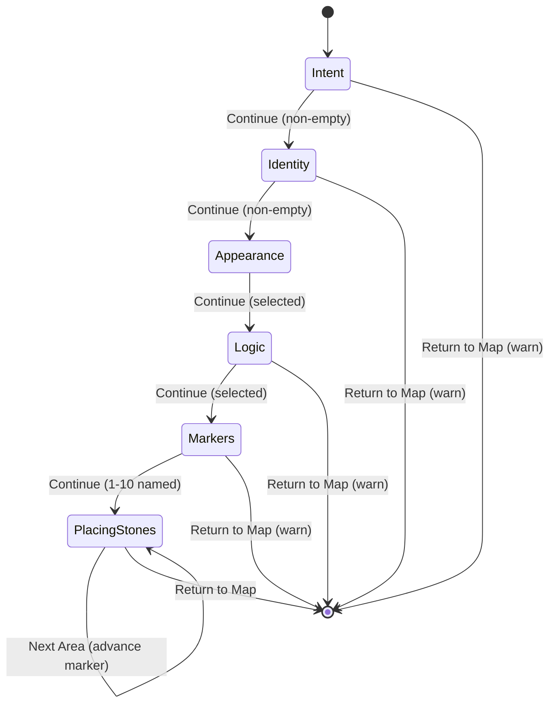

# Voyager Sanctuary — Alignment & Outcome Spec

**Purpose:** Architectural Blueprint — ensures the foundation is poured correctly before implementation.  
**Status:** **OFFICIALLY SIGNED OFF** (March 2026)  
**Related:** [MASTER_LEDGER_ARCHITECTURE_OVERHAUL.md](MASTER_LEDGER_ARCHITECTURE_OVERHAUL.md) — technical implementation spec. [GAPS_AND_ASSUMPTIONS.md](GAPS_AND_ASSUMPTIONS.md) — resolve before implementation.

**Sanctuary DNA:** Refined, Functional, Intent-focused. Move from rigid list to malleable terrain.

---

## 1. Before vs After Summary

### What the User Experiences Today (Before)

| Screen / Flow | Current Experience |
|:--------------|:-------------------|
| **Sanctuary** | User sees Elias, Hearth, compact satchel tray. Tapping Elias opens Management sheet (Seek Guidance, Pack Satchel, Archive, Settings). To create a goal, user must go to Satchel or open the Map and tap FAB. |
| **Creation flow** | User goes to Map → taps "Climb New Mountain" FAB, or Satchel → empty slot → Management → Pack. Flow: Name peak → Name 4 landmarks (fixed) → Add pebbles per landmark. Adding a pebble sometimes resets view back to Landmark 1. Buttons: "Add" and "Add Another" — confusing. |
| **Map / Scroll** | Labeled "The Scroll." User thinks of it as a list. Peaks called "Mountains." |
| **Landmarks** | Exactly 4 required. No flexibility for 1–3 or 5–10 phases. |

### What the User Will Experience After (Target)

| Screen / Flow | Target Experience |
|:--------------|:------------------|
| **Sanctuary** | User taps Elias → Management sheet opens with **"New Journey"** as the first option. One tap to start creating a goal. Optional: direct "Open Map" icon in tray. |
| **Creation flow** | 6-step wizard: (0) Intent — why does this matter? (1) Identity — name the peak. (2) Appearance — icon/style. (3) Logic — Climb (sequential) or Survey (areas). (4) Markers — 1–10, add/remove freely. (5) Placing stones — add pebbles per marker; view stays locked on current marker until "Next Area." Buttons: **Place Pebble** (primary) + **Place & Next Area** (ghost). No view reset. |
| **Map / Peak** | Labeled "The Map." Peaks called "Peaks." Terminology feels like a terrain/journey metaphor. |
| **Markers** | 1–10 markers. "+ Add" / "- Remove." Attempting 11th triggers Elias "Heavy Satchel" warning. |

---

## 2. Acceptance Checklist — OFFICIALLY SIGNED OFF

### Creation Flow

- [x] **1.** When I add a pebble under Marker 3, I stay on Marker 3. The view does not jump back to Marker 1. *(Fixes Loop Bug)*
- [x] **2.** Primary button: **"Place Pebble"**. Secondary (ghost): **"Place & Next Area"**.
- [x] **3.** Two buttons for power users: Place Pebble + Place & Next Area.
- [x] **4.** I can create a goal with 1–10 markers (not fixed 4). *(No more "Fixed 4")*
- [x] **5.** I can add/remove markers with "+ Add" and "- Remove" (when count > 1).
- [x] **6.** Attempting to add an 11th marker shows Elias "Heavy Satchel" warning.
- [x] **7.** Step 5 (Placing stones): I stay on the current marker until I tap "Next Area." No auto-advance.

### Navigation & Entry

- [x] **8.** I can start a new goal by tapping Elias on the Hearth → "New Journey" (first option).
- [x] **9.** I do not need to open Satchel first to create a goal.
- [x] **10.** "Open Map" is reachable from Sanctuary (e.g. icon in tray or near Elias).
- [x] **11.** The Map FAB for "New Journey" still exists for power users who are already on the Map.

### Terminology

- [x] **12.** The goal hierarchy view is called "The Map" (not "The Scroll").
- [x] **13.** A single goal is called a "Peak" (not "Mountain") in user-facing copy.
- [x] **14.** The creation CTA is "New Journey" (not "Climb New Mountain").
- [x] **15.** **Refinement:** Use **"Region"** for Categorical/Survey and **"Milestone"** for Sequential/Climb. In code, they are **Markers**.

### Guided Wizard Steps

- [x] **16.** Step 1 (Intent): Multi-line input. Elias asks why this journey matters.
- [x] **17.** Step 2 (Identity): Single-line input. Elias asks for the peak name.
- [x] **18.** Step 3 (Logic): Toggle between "The Climb" (sequential) and "The Survey" (areas).
- [x] **19.** Step 4 (Markers): Dynamic list 1–10. All must be named before Continue.
- [x] **20.** Step 5 (Placing stones): Add pebbles per marker. "Next Area" advances. "Return to Map" always visible.

### Lifecycle (Optional / Later)

- [x] **21.** "Abandon Peak" archives the peak (moves to Archive Recovery).
- [x] **22.** **Refinement:** The Blueprint Drawer is the **"Bones" view** — the Peak's Heart. **Tap** peak title (not long-press). **Top:** Editable Intent. **Middle:** Visual hierarchy overview. **Bottom:** Rename, Archive, Delete.
- [x] **23.** Swipe-left on a pebble = "Clear the Path" (delete that pebble).
- [x] **24.** Long-press on a marker = Branch Removal with "Move to general" vs "Scatter" choice.
- [x] **25.** "Promote" button on pebble converts it to a new marker.

---

## 3. Quick Alignment Questions — OFFICIALLY ANSWERED

### Q1. After adding a pebble, should the user stay on the same marker or auto-advance?

**Answer:** **Stay.** In the Sanctuary, you don't place one stone and teleport to the next peak. You stay until you're done.

---

### Q2. For "New Journey," should it be the first and most prominent option when tapping Elias?

**Answer:** **Yes.** First position. It turns Elias into the active guide rather than just a settings menu.

---

### Q3. For 1–10 markers: should users add/remove freely, or follow a fixed sequence?

**Answer:** **Free.** Use a `List<Marker>` that can be pushed/popped.

---

### Q4. "Place Pebble" — one button or two?

**Answer:** **Two.** Primary: **Place Pebble**. Secondary (ghost button): **Place & Next Area**. This rewards power users without cluttering the "Refined" UI.

---

### Q5. Branch Removal: "Move to general" vs "Scatter"?

**Answer:**
- **Move to General:** Creates a "Miscellaneous" region at the bottom of the Map for those pebbles.
- **Scatter:** Hard delete. Elias should ask: *"Are you sure? These memories will be lost to the wind."*

---

### Q6. Level Up (Promote): Where does it go?

**Answer:** It becomes a **Sibling Peak** on the Map. If "Buy Roses" was a pebble in "Backyard," Promoting it makes "Buy Roses" its own Peak next to "Backyard."

---

### Q7. Layout types: How should Survey vs Climb look?

**Answer:**
- **The Climb (Sequential):** A vertical path. Solid lines connect the markers. High contrast.
- **The Survey (Categorical):** A "Constellation" or "Island" view. Markers are spread out. No connecting lines. It looks like a map of a sanctuary, not a ladder.

---

## 4. Loom-Style Script (Screen Recording Narration)

Use this script when recording a walkthrough to show the target experience. Read aloud as you click through.

---

**[0:00] Opening**

"Voyager Sanctuary — alignment walkthrough. I'm going to show the target experience after the overhaul."

---

**[0:10] Sanctuary — New Journey entry**

"I'm on the Sanctuary. Elias is by the Hearth, my satchel tray is at the bottom. I tap Elias."

*[Tap Elias]*

"The Management sheet opens. The first option is **New Journey**. I tap it."

*[Tap New Journey]*

"I'm now in the creation wizard. No need to open the Satchel or the Map first."

---

**[0:35] Step 1 — The Intent**

"Step 1: The Intent. The screen is dimmed. Elias asks: *Before we map the terrain, what are we reaching for, and why does this journey matter?* I type my why — maybe a few sentences about passing the CPA exam or finishing the backyard."

*[Type in multi-line field]*

"I tap Continue."

---

**[0:55] Step 2 — The Identity**

"Step 2: The Identity. Elias asks for a name — a title for the peak. I type something like *CPA Exam* or *Backyard Renovation*."

*[Type in single-line field]*

"Continue."

---

**[1:10] Step 3 — The Logic**

"Step 3: The Logic. I choose between **The Climb** — a step-by-step path — or **The Survey** — a collection of areas. For a CPA exam, I might pick Climb. For a peak with separate zones, I might pick Survey."

*[Select option]*

"Continue."

---

**[1:30] Step 4 — The Markers**

"Step 4: The Markers. I see a dynamic list. I can have 1 to 10 markers. I'll add a few: Research, Plan, Execute, Review. If I need more, I tap Add. If I have too many, I remove one. The app won't let me add an 11th — Elias will warn me about a heavy satchel."

*[Add/remove, fill names]*

"All named. Continue."

---

**[2:00] Step 5 — Placing the stones**

"Step 5: Placing the stones. I'm adding pebbles to each marker. I'm on Research. I tap the Research chip to add a pebble. A card appears: Name this pebble. I type *Review study guides* and tap **Place Pebble**."

*[Type, tap Place Pebble]*

"The pebble is created. I'm still on Research. I can add another with Place Pebble, or use the ghost button **Place & Next Area** to place and move in one tap. Or I tap Next Area to move to Plan. The view does not jump back to the first marker — that's the Loop bug fix."

*[Add another pebble, then tap Next Area]*

"Now I'm on Plan. I add pebbles here. When I'm done with all markers, I tap Return to Map."

---

**[2:45] Back to Sanctuary / Map**

"I'm back. My new peak is on the Map. The terminology: we call this the Map, and each goal is a Peak. Creating a journey started from Elias — New Journey — no detour through the Satchel."

---

**[3:00] End**

"That's the target experience. If anything here doesn't match your vision, we adjust the spec before implementation."

---

## 5. Diagrams

### 5.1 Navigation Flow (Before vs After)

```
BEFORE:
┌─────────────┐     ┌─────────────┐     ┌─────────────┐     ┌─────────────────┐
│  Sanctuary  │────▶│   Satchel   │────▶│  Management │────▶│ Pack / Add Goal? │
│  (Elias)    │     │  or empty   │     │    Sheet    │     │  (unclear path)  │
└─────────────┘     │    slot     │     └─────────────┘     └─────────────────┘
                    └─────────────┘
         OR
┌─────────────┐     ┌─────────────┐     ┌─────────────────┐
│  Map/Scroll │────▶│  FAB "+"    │────▶│ Climb New Mtn   │
└─────────────┘     └─────────────┘     └─────────────────┘

AFTER:
┌─────────────┐     ┌─────────────┐     ┌─────────────────┐
│  Sanctuary  │────▶│ Tap Elias   │────▶│ "New Journey"   │
│  (Elias)    │     │             │     │     (first)     │
└─────────────┘     └─────────────┘     └────────┬────────┘
       │                                            │
       │                                            ▼
       │                                     ┌─────────────────┐
       │                                     │ Creation Wizard  │
       │                                     │ (6 steps)        │
       │                                     └─────────────────┘
       │
       └──────────────▶ Optional: "Open Map" icon in tray
```

### 5.2 Creation Wizard State Machine



### 5.3 Step 5 — Placing stones (Loop Bug Fix)

```
BEFORE (bug):
  User on Marker 2 → Add pebble → View resets to Marker 1 ❌

AFTER (fix):
  User on Marker 2 → Place Pebble → View stays on Marker 2 ✓
  User taps "Next Area" → View advances to Marker 3 ✓
```

### 5.4 Screen Hierarchy (Mockup Reference)

```
┌─────────────────────────────────────────────────────────┐
│ SANCTUARY                                                │
├─────────────────────────────────────────────────────────┤
│                                                          │
│   [Background: time-of-day scene]                        │
│                                                          │
│        ┌──────┐                                          │
│        │Elias │  ← Tap → Management sheet                │
│        └──────┘     First option: "New Journey"           │
│                                                          │
│        ┌─────────────────────────────┐                   │
│        │         HEARTH              │                   │
│        │    (drag stones to burn)    │                   │
│        └─────────────────────────────┘                   │
│                                                          │
│   [Elias bubble: contextual message]                     │
│                                                          │
├─────────────────────────────────────────────────────────┤
│  [Compact Satchel Tray]  [Open Map?] [Empty slots → +]   │
└─────────────────────────────────────────────────────────┘

┌─────────────────────────────────────────────────────────┐
│ CREATION WIZARD (full-screen overlay)                    │
├─────────────────────────────────────────────────────────┤
│  [Compass] Return to Map                         [top]   │
│                                                          │
│  ┌─────────────────────────────────────────────────────┐ │
│  │ Elias: "[Step-specific prompt]"                     │ │
│  │                                                      │ │
│  │ [Input field or toggle or list]                     │ │
│  │                                                      │ │
│  │ [Return to Map]                    [Continue]       │ │
│  └─────────────────────────────────────────────────────┘ │
└─────────────────────────────────────────────────────────┘

┌─────────────────────────────────────────────────────────┐
│ STEP 5 — PLACING STONES (Name Pebble card)              │
├─────────────────────────────────────────────────────────┤
│  Name this pebble                                        │
│  Research  ← current marker                              │
│                                                          │
│  [e.g. Review study guides_____________]                 │
│                                                          │
│  [Cancel]  [Place Pebble]  [Place & Next Area?]          │
└─────────────────────────────────────────────────────────┘
```

---

## 6. Mockup Descriptions (Screen-by-Screen)

### 6.1 Sanctuary — After Overhaul

**Layout:** Unchanged visually. Elias, Hearth, satchel tray. Time-of-day background.

**Change:** Tap Elias → Management sheet. **First item:** "New Journey" (icon: compass or path). Below: Seek Guidance, Pack Satchel, Archive Recovery, Settings.

**Optional:** Small "Map" icon in the satchel tray area or near Elias. Tapping opens the Map directly.

---

### 6.2 Management Sheet — After Overhaul

**Before:** Seek Guidance, Pack Satchel, Archive Recovery, Settings.

**After:** **New Journey** (new, first), Seek Guidance, Pack Satchel, Archive Recovery, Settings.

**New Journey:** Opens the creation wizard (6-step overlay). Same flow as current Climb, but with Intent (Step 0), Identity (Step 1), Appearance (Step 2), Logic (Step 3), dynamic markers, and fixed Loop bug.

---

### 6.3 Creation Wizard — Step 1 (Intent)

**Layout:** Dimmed background. Elias on left. Parchment card.

**Content:** Multi-line text field. **Cap: 1,000 characters.** Placeholder: "e.g. I want to pass the CPA exam so I can advance my career and reduce financial stress."

**Elias:** "Before we map the terrain, what are we reaching for, and why does this journey matter?" On 1000 cap: *"Keep it focused. The peak is won with clarity, not volume."*

**Buttons:** Return to Map | Continue

---

### 6.4 Creation Wizard — Step 2 (Identity)

**Layout:** Same as current Step 1.

**Content:** Single-line text field. Placeholder: "e.g. CPA Exam, Home Renovation"

**Elias:** "Let's give this journey a name—a title for the peak."

**Buttons:** Return to Map | Continue

---

### 6.5 Creation Wizard — Step 3 (Logic)

**Layout:** Two selectable cards or toggle.

**Options:**
- **The Climb** — "Step-by-step path. One marker leads to the next."
- **The Survey** — "Collection of areas. Work on any in any order."

**Elias:** "How will you approach this journey?"

**Buttons:** Return to Map | Continue

---

### 6.6 Creation Wizard — Step 4 (Markers)

**Layout:** Dynamic list. Each row: text field + optional "-" (when count > 1). "+ Add" at bottom.

**Labels (contextual from Step 3):** **Milestone 1, 2, 3…** (if Climb) or **Region 1, 2, 3…** (if Survey).

**Validation:** All named. Min 1, max 10. On 11th add: Elias "Heavy Satchel" (e.g. SnackBar or inline message).

**Buttons:** Return to Map | Continue

---

### 6.7 Creation Wizard — Step 5 (Placing stones)

**Layout:** Two states — (A) Marker chips, (B) Name Pebble card.

**(A) Marker chips:** Chips for each marker. Current marker highlighted. Tap chip → open Name Pebble card for that marker.

**(B) Name Pebble card:** "Name this pebble" + marker name. Text field. Buttons: Cancel | **Place Pebble** (primary) | **Place & Next Area** (ghost, secondary).

**Key behavior:** After Place Pebble, return to (A) **on the same marker**. User taps "Next Area" to advance. No reset to Marker 1.

**Buttons (in chip view):** Return to Map | Next Area (or "Done with this marker")

---

### 6.8 Map Screen — Terminology Only

**Visual:** Phase 1: Same tree layout for both Climb and Survey. Phase 2: Island/Constellation for Survey.

**Copy changes:** "The Scroll" → "The Map". "Climb New Mountain" → "New Journey". "Mountain" → "Peak" in labels and Elias.

---

### 6.9 Bones View (Blueprint Drawer)

**Trigger:** Tap Peak Title in Map view. (Not long-press.)

**Layout:**
- **Top:** Editable Intent Statement (same 1000-char cap).
- **Middle:** Visual Hierarchy Overview — small-scale map of Milestones/Regions.
- **Bottom:** Administrative Actions — Rename, Archive, Delete.

**Purpose:** The Peak's Heart. Inspecting the architecture, not just renaming.

---

## 7. Sign-Off — OFFICIALLY COMPLETE

- [x] Acceptance Checklist (§2) — Signed off
- [x] Alignment Questions (§3) — Answered
- [x] Loom script, diagrams, mockups — Approved
- [x] Ready to proceed with implementation

**Foundation locked. Cursor can lay bricks.**

---

## 8. Developer Pre-Flight Schema

**Use DB column names.** Cursor must not create aliases.

| Concept | DB Column | Type |
|:--------|:----------|:-----|
| The Why | `intent_statement` | TEXT, nullable, max 1000 |
| The Identity | `name` | TEXT, not null |
| Logic | `layout_type` | `climb` \| `survey`, default `climb` |
| Status | `is_archived` | BOOLEAN, default false |
| Markers | `nodes` (boulder) | `order_index`, `title` |
| Pebble logic (per marker) | `pebble_logic` | `sequential` \| `freeform`, default `freeform`. Store Phase 1; UI Phase 2. |

**Logic & Leaf (planned):** logic on pebbles for shards; sub-boulders for mixed logic; leaf-only packing; Validity Filter. See MASTER_PLAN § Logic & Leaf Protocol.

**Step 4 labels:** "Milestone N" (Climb) or "Region N" (Survey). Code: always `Marker`/`boulder`.

---

**End of Alignment Spec.**
