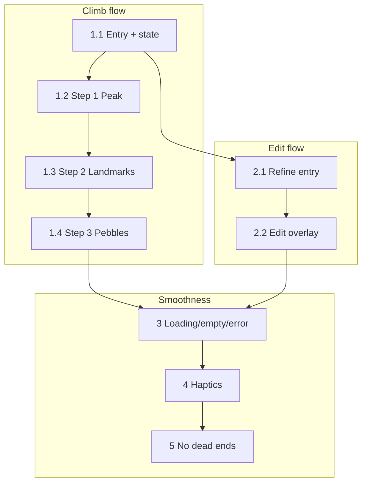

# Phase 1 Implementation Plan (P0)

**Scope:** Foundation — Climb flow, Edit flow, loading/empty/error states, haptics, no dead ends.  
**Source:** [FEATURE_RECOMMENDATIONS_GAMIFIED_EXPERIENCE.md](FEATURE_RECOMMENDATIONS_GAMIFIED_EXPERIENCE.md) P0; [CLIMB_FLOW_SPEC.md](CLIMB_FLOW_SPEC.md); [VOYAGER_SANCTUARY_POLISH_PLAN.md](Completed/VOYAGER_SANCTUARY_POLISH_PLAN.md) Phase 4.

**Definition of done for Phase 1:** User can add a goal (Climb) and refine it (Edit) in a guided way; every screen has loading/empty states and friendly errors; burn/pack/primary buttons have haptics; Compass/Return and Back never trap the user.

**Ready to implement:** Blueprint decisions are locked: Step 3 pebble naming = **Variant B** (dialog first, then create with title; no ghost pebbles). Refine mode entry = from Map (Peak Detail): tap node to open Edit overlay. Whetstone choice overlay (Satchel) offers Sharpen Habits only; no Refine path from Satchel. Task 2.1 wires Edit flow to Scroll/Map tap-on-node—no entry from Satchel overlay.

---

## Task order and dependencies

Execute in order. Climb (1.x) and Edit (2.x) can be parallelized after 1.1–1.2; loading/empty/error (3.x) and haptics (4.x) can run in parallel once 1 and 2 are in progress or done.

---

## Engineer-to-Engineer: Technical Nuances

These points keep the **Refined Architectural Luxury** aesthetic intact under the hood. Implement them in the referenced tasks.

| Concern | Recommendation | Tasks |
|--------|----------------|-------|
| **Z-Index of Elias** | Render Elias inside the Climb overlay using a **Stack**. Elias (140×210) should **slightly overlap** the parchment text bubble or inputs. If he sits strictly above/below in a Column, he feels like a UI element; overlap makes him feel like a character visiting the screen. | 1.2, 1.3 |
| **PopScope and data loss** | Differentiate “closing overlay” vs “losing data.” **Step 3 (Pebbles):** Back / Return to Map = **silent save** (partial progress already persisted). **Step 1 (or Step 2) mid-typing:** On Back, show a **SnackBar or Elias line** (e.g. “Leaving so soon? Your progress here will be lost.”) instead of a jarring system dialog; then close. Do not use a blocking “Discard?” dialog. | 6.1 |
| **Riverpod scoping** | Make **ClimbFlowNotifier** an **autoDispose** provider. Every time “Climb New Mountain” opens, the user gets a **fresh slate** — no persisted “Step 2” or half-typed landmark names from a previous run. | 1.1 |
| **Mallet visual (sound stubbed)** | With sound stubbed, **over-deliver on visual feedback**. Use **RotationTransition**: backswing from 0° to **-15°**, then a **quick snap** to **+10°** (the strike). This “anticipation and follow-through” reads as high-end gamification rather than a bumpy scale. | 1.4 |

---

## 1. Climb New Mountain flow

**Spec:** [CLIMB_FLOW_SPEC.md](CLIMB_FLOW_SPEC.md).  
**Files:** [lib/features/scroll_map/scroll_map_screen.dart](lib/features/scroll_map/scroll_map_screen.dart), [lib/core/content/elias_dialogue.dart](lib/core/content/elias_dialogue.dart), [lib/providers/mountain_provider.dart](lib/providers/mountain_provider.dart), [lib/providers/node_provider.dart](lib/providers/node_provider.dart).

### 1.1 Entry points and flow state

- **Task:** Replace the current add-mountain entry with the Climb flow. Add flow state (step, mountainId, mountainName, boulderIds, landmarkNames, pebbleStepBoulderIndex, lastEliasKey) in a stateful widget or Riverpod notifier (e.g. `ClimbFlowNotifier` / `ClimbFlowState`).
- **File refs:** [scroll_map_screen.dart](lib/features/scroll_map/scroll_map_screen.dart): replace `_showAddMountainDialog` (around line 718) and the empty-state / app bar `+` handlers with a single “open Climb flow” action. Gate with `canAddMountainProvider`; if false, show SnackBar “You are climbing 3 mountains. Archive one before opening a new path.” and do not open.
- **Technical nuance — Riverpod scoping:** Use an **autoDispose** provider for `ClimbFlowNotifier`. When the overlay is closed, state is disposed so the next time “Climb New Mountain” opens, the user gets a **fresh slate** (no leftover Step 2 or half-typed landmark names from a previous run).
- **Acceptance criteria:**
  - Tapping “Climb New Mountain” (bottom of Scroll), empty state “Open a New Path,” or app bar `+` opens the same full-screen Climb overlay when `canAddMountainProvider` is true.
  - At 3 active mountains, all three entry points show the cap SnackBar and do not open the overlay.
  - Flow state survives rebuilds while overlay is open and is available to overlay children. After overlay closes, reopening starts at Step 1 with empty state (autoDispose).

### 1.2 Step 1 — Name the Peak

- **Task:** Implement Step 1 UI and logic: full-screen overlay, Compass top-right (“Return to Map”), Elias (large, e.g. 140×210), peak prompt line, single text field (placeholder “e.g. CPA Exam, Home Renovation”), subtext “This is your primary objective,” Continue / Return to Map. On Continue: validate non-empty trim; call `mountainActionsProvider.create(name)`; on success set mountainId/mountainName and go to Step 2; on failure SnackBar “Give the peak a name.”
- **File refs:** New widget(s) for Climb overlay (e.g. in scroll_map or a new `lib/features/scroll_map/climb_flow_overlay.dart`). [elias_dialogue.dart](lib/core/content/elias_dialogue.dart): add `climbPeakPrompt()` and pool with 3–5 variants (no repeat same twice in a row). [mountain_repository.dart](lib/data/repositories/mountain_repository.dart): `create` already returns `Mountain`; use `created.id` and `created.name`.
- **Technical nuance — Z-Index of Elias:** Lay out the Climb overlay with a **Stack**. Place Elias (140×210) so he **slightly overlaps** the parchment/bubble or the input area. Overlap gives “luxury” depth and makes Elias feel like a character on the screen rather than a UI element in a Column. Same pattern for Step 2 (and Step 3 if Elias is present).
- **Acceptance criteria:**
  - Compass closes overlay and returns to Scroll; no mountain created if user has not tapped Continue.
  - Empty/whitespace name blocks Continue and shows validation message.
  - Valid name creates mountain and advances to Step 2; `mountainListProvider` refreshed so Scroll can show the new mountain when overlay closes later. Elias is rendered in a Stack with subtle overlap of content.

### 1.3 Step 2 — Name the Four Landmarks

- **Task:** Step 2 screen: same overlay style, Compass, Elias landmarks prompt, subtext “Define the four major phases…”, four landmark inputs (2×2 grid on desktop, vertical zig-zag on mobile per spec), Continue / Return to Map. On Continue: validate all four non-empty; for each call `nodeActionsProvider.createBoulder(mountainId, title)`; store boulderIds and landmarkNames; go to Step 3. Return to Map closes overlay; mountain and any boulders already created remain.
- **File refs:** Same overlay module. [elias_dialogue.dart](lib/core/content/elias_dialogue.dart): add `climbLandmarksPrompt()`. [node_repository.dart](lib/data/repositories/node_repository.dart): `createBoulder` already exists.
- **Technical nuance — Z-Index:** Use the same **Stack** layout as Step 1 so Elias slightly overlaps the landmark cards/inputs for consistent “character on screen” depth.
- **Acceptance criteria:**
  - All four names required; “Name all four landmarks.” (or per-field) if any empty.
  - Four boulders created in order; boulderIds and landmarkNames stored for Step 3.
  - Return to Map leaves existing data in DB and closes overlay.

### 1.4 Step 3 — Break Stones into Pebbles

- **Task:** Step 3 screen: Compass, Elias pebbles prompt, four tappable landmark “stones,” current stone highlighted. **Variant B (dialog first):** Tap stone → show “Name this pebble” dialog first → on “Add” / confirm, create pebble with that title (single `createPebble` with title), then rock_break (stub OK) + **mallet animation** + haptic + stone scale 1.05. No empty/ghost pebbles in the database. Buttons: “Done with this landmark” / “Next stone” (advance pebbleStepBoulderIndex; when index >= 4 show “Path is clear…” and single “Return to Map”), “Return to Map” always visible.
- **Rationale:** Variant B keeps the database clean and makes naming the action that “summons” the pebble—the stone “breaks” only after the user confirms the name. Variant A would create untitled records before the user commits.
- **File refs:** Same overlay. [elias_dialogue.dart](lib/core/content/elias_dialogue.dart): add `climbPebblesPrompt`, `climbPebbleAdded`, `climbNextLandmark`, `climbAllDone`, `climbReturnToMap` pools. [node_repository.dart](lib/data/repositories/node_repository.dart): `createPebble` (with title). Refresh `nodeListProvider(mountainId)` after each create.
- **Technical nuance — Mallet visual (sound stubbed):** With sound stubbed, **over-deliver on visual feedback** so the interaction still feels enjoyable. Do not rely on scale alone. Use **RotationTransition** (or equivalent): **backswing** from 0° to **-15°** (anticipation), then a **quick snap** to **+10°** (the strike). This “anticipation and follow-through” reads as high-end gamification rather than a bumpy one-step scale. Keep haptic and stone scale 1.05; the rotation sells the hit. Reuse `assets/mallet/mallet.png`; fade mallet out after impact per CLIMB_FLOW_SPEC.
- **Acceptance criteria:**
  - Tapping a stone opens “Name this pebble” dialog; on Add/confirm, pebble is created with that title and the stone “breaks” (mallet + haptic + scale). User can add multiple pebbles per stone. No untitled pebbles in the database.
  - Mallet animates: backswing to -15°, then snap to +10° (strike); haptic and stone scale 1.05 on impact; mallet fades out after hit.
  - “Done with this landmark” advances to next stone; after fourth, “Path is clear” and one “Return to Map” closes overlay.
  - Compass / Return to Map at any time closes overlay; partial progress saved. Android Back = Return to Map.

---

## 2. Edit (Refine) flow

**Spec:** [VOYAGER_SANCTUARY_POLISH_PLAN.md](Completed/VOYAGER_SANCTUARY_POLISH_PLAN.md) Phase 4.  
**Files:** [lib/features/satchel/satchel_screen.dart](lib/features/satchel/satchel_screen.dart), [lib/features/scroll_map/scroll_map_screen.dart](lib/features/scroll_map/scroll_map_screen.dart), [lib/core/content/elias_dialogue.dart](lib/core/content/elias_dialogue.dart).

### 2.1 Refine mode entry

- **Task:** From Map (Scroll), user enters Edit flow by tapping a node in Peak Detail. No Refine entry from Satchel (Whetstone overlay offers Sharpen Habits only). Tapping a node opens the Edit overlay. Refine mode (if used) stays on until user leaves Scroll or back to Sanctuary/Satchel.
- **File refs:** [scroll_map_screen.dart](lib/features/scroll_map/scroll_map_screen.dart): when in Peak Detail (or Refine mode), tap on peak/landmark/pebble opens Edit overlay. [satchel_screen.dart](lib/features/satchel/satchel_screen.dart): Whetstone overlay offers Sharpen Habits only; no Refine path button.
- **Acceptance criteria:**
  - Tapping a node on Map (Peak Detail) opens Edit overlay. (Refine entry is from Map, not Satchel.)
  - Tapping a node (peak, boulder, pebble) opens Edit overlay with Elias. Refine mode remains on after an edit; user can tap another node without re-entering from Satchel.

### 2.2 Edit overlay and actions

- **Task:** Edit overlay: same pattern as Climb (dimmed background, Compass, Elias). Context-aware actions: Rename (peak/landmark/pebble), Add pebble under this landmark, Delete (with narrative copy). Use `mountainActionsProvider.rename`, `nodeActionsProvider.updateTitle`, `createPebble`, `deleteSubtree`. Add Elias pools: openEdit, afterRename, afterAddPebble, afterDelete (2–3 variants each).
- **File refs:** New or shared overlay widget (can reuse layout from Climb with `isEdit: true`). [elias_dialogue.dart](lib/core/content/elias_dialogue.dart): add edit pools. [scroll_map_screen.dart](lib/features/scroll_map/scroll_map_screen.dart): wire tap-on-node in Refine mode to open overlay with selected node; call APIs on action.
- **Acceptance criteria:**
  - Rename updates title and shows afterRename line; Add pebble creates under selected boulder and shows afterAddPebble; Delete confirms and calls deleteSubtree, shows afterDelete.
  - Compass or Back closes overlay and returns to Scroll; Refine mode still on. Leaving Scroll (e.g. back to Sanctuary) exits Refine mode.

---

## 3. Loading and empty states

**Spec:** [FEATURE_RECOMMENDATIONS_GAMIFIED_EXPERIENCE.md](FEATURE_RECOMMENDATIONS_GAMIFIED_EXPERIENCE.md) §3.1.  
**Files:** [lib/features/scroll_map/scroll_map_screen.dart](lib/features/scroll_map/scroll_map_screen.dart), [lib/features/satchel/satchel_screen.dart](lib/features/satchel/satchel_screen.dart), [lib/features/whetstone/whetstone_screen.dart](lib/features/whetstone/whetstone_screen.dart).

### 3.1 Loading states

- **Task:** For every async screen (Scroll, Satchel, Whetstone) and for Climb/Edit overlays when data is loading, show a clear loading state (skeleton or spinner in theme colors). Never show a blank list while data is loading.
- **File refs:** Each screen’s build: when `isLoading` or equivalent is true, show `CircularProgressIndicator` or skeleton using [app_colors.dart](lib/core/constants/app_colors.dart) / [app_theme.dart](lib/core/constants/app_theme.dart). Scroll: mountainListProvider asyncValue; Satchel: satchel slots loading; Whetstone: whetstoneProvider isLoading.
- **Acceptance criteria:**
  - Scroll shows loading indicator until mountains/nodes are available.
  - Satchel shows loading until slots are resolved.
  - Whetstone shows loading until habits/completions are resolved. Climb/Edit overlay shows loading if any async create/refresh is in progress (optional; can be in-line on button).

### 3.2 Empty states with next action

- **Task:** Each empty state has one clear next action. Scroll (no mountains): “Climb New Mountain” / “Open a New Path” and CTA opens Climb flow. Satchel (empty): “Pack your satchel from the Scroll” + button to Pack or go to Scroll. Whetstone (no habits): “Add a habit to sharpen each day” + Add button.
- **File refs:** [scroll_map_screen.dart](lib/features/scroll_map/scroll_map_screen.dart): `_EmptyState` (around line 2401) — ensure onAdd opens Climb flow and label is “Climb New Mountain” or “Open a New Path.” [satchel_screen.dart](lib/features/satchel/satchel_screen.dart): empty state copy and Pack / Navigate to Scroll. [whetstone_screen.dart](lib/features/whetstone/whetstone_screen.dart): empty state and Add habit.
- **Acceptance criteria:**
  - Scroll empty: one sentence + one CTA that opens Climb flow.
  - Satchel empty: one sentence + Pack or go to Scroll.
  - Whetstone empty: one sentence + Add habit. No dead-end empty screens.

---

## 4. Error handling

**Spec:** [FEATURE_RECOMMENDATIONS_GAMIFIED_EXPERIENCE.md](FEATURE_RECOMMENDATIONS_GAMIFIED_EXPERIENCE.md) §3.2.  
**Files:** All screens that perform create/update/delete or network calls.

### 4.1 Friendly error copy and retry

- **Task:** Replace raw exception text with friendly messages. Network errors: e.g. “Can’t reach the fire. Check your connection and try again.” + retry. Create/update failure: “Couldn’t save. Try again.” SnackBar or inline; where possible keep user input so they can retry without re-typing.
- **File refs:** [scroll_map_screen.dart](lib/features/scroll_map/scroll_map_screen.dart), [satchel_screen.dart](lib/features/satchel/satchel_screen.dart), [auth screen](lib/features/auth/auth_screen.dart), [management_menu_sheet.dart](lib/features/management/management_menu_sheet.dart). Catch in async flows; show SnackBar with `behavior: SnackBarBehavior.floating` and friendly text; do not show `e.toString()` to user.
- **Acceptance criteria:**
  - No raw exception or stack trace in UI. Network and save errors show a single, actionable message and (where applicable) retry or retained input.

---

## 5. Haptics

**Spec:** [FEATURE_RECOMMENDATIONS_GAMIFIED_EXPERIENCE.md](FEATURE_RECOMMENDATIONS_GAMIFIED_EXPERIENCE.md) §3.3; P0 = burn, pack, primary Climb/Edit buttons.  
**Files:** [lib/features/sanctuary/sanctuary_screen.dart](lib/features/sanctuary/sanctuary_screen.dart), [lib/features/scroll_map/scroll_map_screen.dart](lib/features/scroll_map/scroll_map_screen.dart), [lib/features/satchel/satchel_screen.dart](lib/features/satchel/satchel_screen.dart), [lib/features/management/management_menu_sheet.dart](lib/features/management/management_menu_sheet.dart).

### 5.1 Haptic on burn, pack, and primary buttons

- **Task:** Add haptic feedback: (1) when a stone is dropped on the Hearth (burn); (2) when Pack adds stones to the satchel; (3) when primary Climb/Edit buttons are tapped (Continue, Set the Peak, Clear the Path, Return to Map on final step, and Edit overlay primary actions). Use `HapticFeedback.lightImpact()` or `mediumImpact()` as appropriate (contextual weight by node type is P2).
- **File refs:** [sanctuary_screen.dart](lib/features/sanctuary/sanctuary_screen.dart): Hearth `onAccept` or drop callback — trigger haptic before or after burn. [management_menu_sheet.dart](lib/features/management/management_menu_sheet.dart) or Pack flow: haptic when stones are added. Climb overlay: haptic on Continue / Set the Peak / Clear the Path / primary Step 3 actions. Edit overlay: haptic on Rename / Add pebble / Delete confirm.
- **Acceptance criteria:**
  - Burn: one haptic on successful drop-to-Hearth. Pack: haptic when Pack completes and slots fill. Climb Step 1–3 and Edit primary actions: haptic on tap. No haptic on Compass/Return (optional; can be light).

---

## 6. No dead ends

**Spec:** [FEATURE_RECOMMENDATIONS_GAMIFIED_EXPERIENCE.md](FEATURE_RECOMMENDATIONS_GAMIFIED_EXPERIENCE.md) §3.4.  
**Files:** Climb overlay, Edit overlay, Satchel, Sanctuary.

### 6.1 Compass, Back, and next steps

- **Task:** Ensure (1) Compass / “Return to Map” is always visible in Climb and Edit overlays and closes overlay (partial progress saved). (2) Android Back button in overlay = Return to Map. (3) After Pack, user lands on Sanctuary or Satchel with clear next step (drag to Hearth or open Satchel). (4) After Burn, user remains in Sanctuary; no blocking modal unless rare/important.
- **Technical nuance — PopScope and data loss:** Differentiate “closing overlay” from “losing data.” Use **PopScope** (or `WillPopScope`) to intercept Back. **Step 3 (Pebbles):** Back / Return to Map = **silent save** — partial progress is already persisted per create; close overlay with no prompt. **Step 1 or Step 2 (e.g. user has typed but not confirmed):** On Back, show a **SnackBar or Elias line** (e.g. “Leaving so soon? Your progress here will be lost.”) then close overlay. Do **not** use a blocking system “Discard?” dialog; the SnackBar/Elias line is enough to signal loss without feeling jarring.
- **File refs:** Climb/Edit overlay: Compass in app bar or top-right; `PopScope` to intercept Back — implement step-aware behavior above. [management_menu_sheet.dart](lib/features/management/management_menu_sheet.dart) / Pack: after pack, dismiss sheet and show SnackBar or Elias line; do not open a second modal. [sanctuary_screen.dart](lib/features/sanctuary/sanctuary_screen.dart): after burn, no “OK” modal; optional Elias line only.
- **Acceptance criteria:**
  - Climb Step 3: Back / Compass closes overlay with no prompt; partial progress already saved. Step 1/2 with unsaved input: Back shows SnackBar or Elias line about progress lost, then closes; no system dialog.
  - Edit: Compass and Back close overlay; Refine mode still on. After Pack, user sees next step without being stuck. After Burn, user stays on Sanctuary with no required dialog.

---

## Open decisions (resolve before or during implementation)

| Decision | Options | Recommendation |
|----------|---------|-----------------|
| Climb entry points | All three (bottom button, empty state, app bar +) vs. start with two | Implement all three per CLIMB_FLOW_SPEC. |
| **Step 3 pebble naming** | Variant A (create then name) vs. **Variant B** (dialog first, then create with title) | **Variant B.** Dialog first; on confirm, create pebble with title. Keeps DB clean; naming “summons” the pebble. |
| Sound (burn, rock_break) | Real assets vs. stub | Stub (no-op or conditional on asset path) so Phase 1 is not blocked. |
| Edit/Refine entry | From Map (Peak Detail) only | Refine/Edit from Map: tap node to open Edit overlay. Whetstone overlay (Satchel) offers Sharpen Habits only. |

---

## Phase 1 sign-off

- [ ] 1.1–1.4: Climb flow complete per CLIMB_FLOW_SPEC; all three entry points; cap enforced.
- [ ] 2.1–2.2: Edit (Refine) flow complete; entry from Map (Peak Detail, tap node); overlay with Rename / Add pebble / Delete.
- [ ] 3.1–3.2: Loading state on Scroll, Satchel, Whetstone; empty states with one clear next action.
- [ ] 4.1: Friendly error copy; no raw exceptions; retry or retained input where possible.
- [ ] 5.1: Haptics on burn, pack, and primary Climb/Edit buttons.
- [ ] 6.1: Compass/Return and Back close overlays; no dead ends after Pack or Burn.

When all boxes are checked, Phase 1 is complete and Phase 2 (P1) can start.
