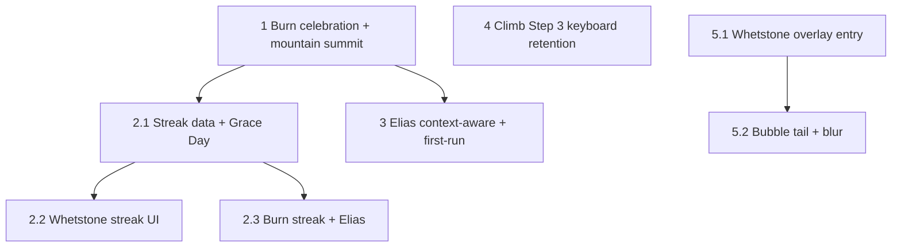

# Phase 2 Implementation Plan (P1)

**Scope:** Gamification and polish — burn celebration and mountain completion, streaks (Grace Day + midnight logic), Elias context-aware and first-run lines, Climb Step 3 keyboard retention, Whetstone choice overlay with bubble tail and watercolor blur.  
**Source:** [FEATURE_RECOMMENDATIONS_GAMIFIED_EXPERIENCE.md](FEATURE_RECOMMENDATIONS_GAMIFIED_EXPERIENCE.md) P1; §1.1 (streaks), §1.3 (celebrations), §1.4 (Elias), §2.3 (keyboard), §3.5 (Whetstone overlay), §4 (first-run).

**Prerequisite:** Phase 1 (P0) complete — Climb flow, Edit flow, loading/empty/error, haptics, no dead ends.

**Definition of done for Phase 2:** Burn feels like a moment (sound + haptic + Elias); mountain summit triggers one-time celebration; Whetstone and burn streaks with Grace Day (and midnight-safe logic) are visible; Elias reflects state and first-run; pebble naming keeps keyboard up; Whetstone choice overlay has bubble tail (GlobalKey-anchored) and watercolor blur.

---

## Construction Audit (Phase 2)

When implementing these items, confirm per [FEATURE_RECOMMENDATIONS_GAMIFIED_EXPERIENCE.md](FEATURE_RECOMMENDATIONS_GAMIFIED_EXPERIENCE.md) “Construction Audit for Cursor”:

| Item | What to verify | Where in Phase 2 |
|------|----------------|------------------|
| **Midnight logic (4:00 AM boundary)** | Streak “day” = calendar day after **normalizing timestamp by subtracting 4 hours** (4:00 AM reset). No reset while user is in an active session; 1:00 AM counts as “previous day” until 4:00 AM. | Tasks 2.1–2.2 (streaks) |
| **GlobalKey bubble tail** | Whetstone overlay: bubble tail tip anchored to **computed center** of Whetstone icon via GlobalKey + RenderBox (`localToGlobal` / position), not static offset. | Task 5.2 |

---

## Engineer-to-Engineer: Technical Nuances

Implementation tips to keep the experience premium and avoid “bumpy” or repetitive behavior.

| Concern | Recommendation | Tasks |
|--------|----------------|-------|
| **Midnight buffer (4:00 AM reset)** | For late-night workers (e.g. Vista): a **4:00 AM “day” boundary** is preferable to a 24h window. A burn at 11:00 PM Monday and next session at 1:00 AM Wednesday (technically Tuesday night) would break the streak under 24h; with 4:00 AM, that 1:00 AM session counts as “Tuesday” and preserves momentum. In **StreakService**, normalize all timestamps by **subtracting 4 hours** before computing the “calendar day” for streak logic. | 2.1 |
| **Ember celebration (mountain summit)** | Don’t rely on Elias line alone. Use a simple **OverlayEntry** to fire a **one-time particle burst** over the Hearth: a few **gold-colored** `Container` (or `CustomPainter`) bits with **random upward velocity** and **opacity fade**. No heavy engine (Forge/Flame); lightweight and thematic. | 1.2 |
| **GlobalKey & overlay timing** | The Whetstone icon’s **RenderBox** can be **null** if the overlay opens before the Satchel has finished its **entry animation**. Wrap the tail position calculation in **`WidgetsBinding.instance.addPostFrameCallback`** so the icon is fully laid out and painted (and global position is stable) before drawing the bubble tail. Calculate `localToGlobal` **inside** the overlay's build or a `LayoutBuilder` so the tail finds its home on tablet/rotation. | 5.2 |
| **Tail path (organic feel)** | Use a **CustomPainter** to draw a simple isosceles triangle. Set `color` to parchment hex; give the tip a very slight **borderRadius** (0.5 or 1.0). Sharp points feel "digital"; slightly rounded points feel "hand-drawn/organic." | 5.2 |
| **Elias “contextual memory”** | To avoid Elias feeling repetitive: add a **`lastSeen`** (or equivalent) timestamp per context key (e.g. `satchelFull`, `atMountainCap`). If he said “Your satchel is full” and the user taps Pack again **within ~2 seconds**, **stay silent** or give only a very short nudge. Keeps the “refined” feel instead of a chatty AI. | 3.1 |

---

## Task order and dependencies

- **1** can start first (builds on Phase 1 Hearth and burn path).
- **2.1** depends on completion data (burn/habit) and is needed for 2.2 and 2.3.
- **3** (Elias + first-run) can run in parallel with 2 after 1; needs burn/Pack/habit and mountain-list state.
- **4** is a focused change in Climb Step 3 (Phase 1 overlay).
- **5.1** and **5.2** assume Satchel screen exists and Whetstone is tappable (Polish Plan layout); 5.2 implements **bubble tail only** (blur already at sigma 8 — keep it).

---

## 1. Burn celebration and mountain completion

**Spec:** [FEATURE_RECOMMENDATIONS_GAMIFIED_EXPERIENCE.md](FEATURE_RECOMMENDATIONS_GAMIFIED_EXPERIENCE.md) §1.3.  
**Files:** [lib/features/sanctuary/sanctuary_screen.dart](lib/features/sanctuary/sanctuary_screen.dart), [lib/providers/satchel_provider.dart](lib/providers/satchel_provider.dart), [lib/core/content/elias_dialogue.dart](lib/core/content/elias_dialogue.dart), [lib/providers/node_provider.dart](lib/providers/node_provider.dart) (or node/mountain list for “last pebble” detection).

### 1.1 Burn moment (sound, haptic, Elias)

- **Task:** When a stone is dropped on the Hearth and burn completes: (1) play short burn sound (ember crackle or “stone settled”) — stub OK if asset missing; (2) keep haptic (Phase 1); (3) show Elias line from existing `afterBurn()` pool. Ensure animation completes before any navigation or dismiss so the moment is clear.
- **File refs:** [sanctuary_screen.dart](lib/features/sanctuary/sanctuary_screen.dart): `_HearthWidget` `DragTarget.onAcceptWithDetails` — after `burnPebble`/satchel clear, trigger sound (e.g. `AudioPlayer` or stub), then show Elias bubble/speech with `EliasDialogue.afterBurn()`. Sequence: animation → sound → haptic → Elias line (no modal).
- **Acceptance criteria:**
  - Burn triggers sound (or no-op if stubbed), haptic, and one Elias line from pool.
  - User remains on Sanctuary; no blocking “OK” dialog. Animation (if any) finishes before Elias appears.

### 1.2 Mountain summit celebration

- **Task:** When the burned pebble is the **last pebble of its mountain** (no other pebbles left on that mountain), trigger one-time celebration: Elias line (e.g. “The peak is yours.”), **plus** a visual ember burst over the Hearth, and optional “Mountain summited” badge/subtitle in Scroll. Use existing Elias pool or add `mountainSummit()` with 2–3 variants.
- **Technical nuance — Ember celebration:** Do not rely on Elias line alone. Use a simple **OverlayEntry** (inserted over the Hearth area) to show a **one-time particle burst**: a handful of **gold-colored** `Container` (or small `CustomPainter`) “bits” with **random upward velocity** and **opacity fade-out**. No Forge/Flame or heavy engine; keeps the effect high-end and thematic without new dependencies.
- **File refs:** In the burn flow (sanctuary + satchel_provider): before or after burn, determine if the node was the last pebble of its mountain. If yes, show summit Elias line and insert the ember OverlayEntry (remove after ~1–1.5s or when animation ends). [elias_dialogue.dart](lib/core/content/elias_dialogue.dart): add `mountainSummit()` pool. [scroll_map_screen.dart](lib/features/scroll_map/scroll_map_screen.dart): optional subtitle/badge on mountain card when all pebbles burned.
- **Acceptance criteria:**
  - Last pebble of a mountain triggers distinct Elias line **and** a visible ember/spark burst over the Hearth (gold, upward, fading).
  - Optional: Scroll shows “Mountain summited” or similar. One-time feel; no repeat for same mountain.

---

## 2. Streaks (Whetstone + burn) with Grace Day

**Spec:** [FEATURE_RECOMMENDATIONS_GAMIFIED_EXPERIENCE.md](FEATURE_RECOMMENDATIONS_GAMIFIED_EXPERIENCE.md) §1.1.  
**Files:** New or extended provider(s) for streak state; [lib/features/whetstone/whetstone_screen.dart](lib/features/whetstone/whetstone_screen.dart); [lib/features/sanctuary/sanctuary_screen.dart](lib/features/sanctuary/sanctuary_screen.dart); persistence (e.g. Supabase table `user_streaks` or derive from `whetstone_completions` + completion timestamps for burns).

### 2.1 Streak data model and Grace Day logic

- **Task:** Persist per user: for **Whetstone streak** — consecutive days with at least one habit completed; for **burn streak** — consecutive days with at least one pebble burned. Store `current_streak`, `last_activity_date`, and for Option A `grace_used` (bool), or derive from last two activity dates for Option B. Implement **Grace Day**: one missed day freezes (A) or drops by 2 (B); two consecutive misses reset to 0. **Construction nuance — midnight transition:** Use a **4:00 AM “day” boundary** (recommended for late-night workers) so “today” does not flip at local midnight and a session at e.g. 1:00 AM still counts as the previous “day” until 4:00 AM.
- **Technical nuance — 4:00 AM reset (“midnight buffer”):** For professionals working late (e.g. Vista): a **4:00 AM boundary** is superior to a 24h window. Example: burn at 11:00 PM Monday, next session 1:00 AM Wednesday (Tuesday night) — 24h would break the streak; with 4:00 AM, that 1:00 AM session counts as “Tuesday” and preserves momentum. In **StreakService** (or equivalent), **normalize all timestamps by subtracting 4 hours** before calculating the “calendar day” used for streak logic. So “day” = date of (timestamp - 4h) in local time.
- **File refs:** New provider(s) and a shared **StreakService** (or helper): read from `WhetstoneRepository`/completions and burn records. When comparing “today” vs “yesterday,” use normalized calendar day (timestamp - 4 hours then take date). Apply Grace Day on that same boundary. Document Option A vs B; recommend 4:00 AM as default day boundary.
- **Acceptance criteria:**
  - One missed day does not reset streak to 0 (freeze or -2 per chosen option).
  - Two consecutive missed days reset streak to 0.
  - Streak uses 4:00 AM day boundary: activity at 1:00 AM counts as “previous calendar day” until 4:00 AM, so streak is not broken mid-session.

### 2.2 Whetstone streak display

- **Task:** Show current Whetstone streak on the Whetstone screen (e.g. “7-day streak”). Optionally in Sanctuary, after a habit is completed or on entry, show Elias line “You’ve tended the stone seven days running.” when streak > 0.
- **File refs:** [whetstone_screen.dart](lib/features/whetstone/whetstone_screen.dart): watch `whetstone_streak_provider` (or equivalent); display streak count in header or a small badge. [sanctuary_screen.dart](lib/features/sanctuary/sanctuary_screen.dart) or Elias trigger: optional line when returning from Whetstone or on habit complete.
- **Acceptance criteria:**
  - Whetstone screen shows current habit streak (e.g. “X-day streak”). Optional: Sanctuary/Elias mentions streak when relevant.

### 2.3 Burn streak display and Elias line

- **Task:** After a burn, optionally show burn streak in a small badge or Elias line (e.g. “Three days in a row you’ve fed the fire.”). Use same Grace Day and midnight logic as 2.1.
- **File refs:** [sanctuary_screen.dart](lib/features/sanctuary/sanctuary_screen.dart): after burn, read `burn_streak_provider`; if streak >= 2, show Elias line from a small pool (e.g. “X days in a row you’ve fed the fire.”). [elias_dialogue.dart](lib/core/content/elias_dialogue.dart): add `burnStreakLine(int days)` or pool with tokens.
- **Acceptance criteria:**
  - After a burn, user can see or hear burn streak (Elias line or badge) when streak >= 2. Same Grace Day and midnight behavior as Whetstone streak.

---

## 3. Elias context-aware and first-run lines

**Spec:** [FEATURE_RECOMMENDATIONS_GAMIFIED_EXPERIENCE.md](FEATURE_RECOMMENDATIONS_GAMIFIED_EXPERIENCE.md) §1.4, §4.2.  
**Files:** [lib/core/content/elias_dialogue.dart](lib/core/content/elias_dialogue.dart), [lib/features/sanctuary/sanctuary_screen.dart](lib/features/sanctuary/sanctuary_screen.dart), [lib/features/management/management_menu_sheet.dart](lib/features/management/management_menu_sheet.dart), shared_preferences or profile for first-run flags.

### 3.1 Context-aware lines

- **Task:** Elias reflects state: satchel full → “Your satchel is full. Burn a stone before you add more.”; at mountain cap (3 active) → “You’ve got three peaks. Finish one before you start another.”; return after long idle (e.g. no burn in 3+ days) → “The fire’s still here. Whenever you’re ready.” (no guilt phrasing). Use existing `EliasDialogue` and add pools or methods that take context (e.g. `satchelFull()`, `atMountainCap()`, `returnAfterIdle()`). Trigger at appropriate moments (e.g. when opening Pack with 0 empty slots; when tapping Climb at cap; when entering Sanctuary after idle).
- **Technical nuance — Elias “contextual memory”:** To avoid Elias feeling repetitive or chatty: store a **`lastSeen`** timestamp (or equivalent) per context key (e.g. `satchelFull`, `atMountainCap`, `returnAfterIdle`). If he already showed a line for that context **within the last ~2 seconds** (e.g. user tapped Pack again right after “Your satchel is full”), **stay silent** or show only a very short nudge. This keeps the “refined” feel instead of repeating the same line.
- **File refs:** [elias_dialogue.dart](lib/core/content/elias_dialogue.dart): add context-aware pools. Call site (e.g. management_menu_sheet, scroll_map_screen, sanctuary_screen): before showing a context line, check lastSeen for that key; if &lt; 2s ago, skip or use a one-word nudge. Store lastSeen in StateProvider or a small service (e.g. `eliasContextLastSeenProvider` with map of key → DateTime). [management_menu_sheet.dart](lib/features/management/management_menu_sheet.dart): when Pack is tapped and satchel is full, show Elias line only if lastSeen for `satchelFull` is stale. Same pattern for at-cap and return-after-idle.
- **Acceptance criteria:**
  - Satchel full + Pack tap → Elias line about burning a stone first (unless same context was shown &lt; ~2s ago, then silent or short nudge). At cap + Climb tap → message about finishing a peak (same throttle). Return after idle → encouraging line, no “You haven’t…”. Elias does not repeat the same context line in quick succession.

### 3.2 First-run nudges (first Pack, first Burn)

- **Task:** First time user taps Pack and slots fill: show Elias line “Your satchel is packed. Drag a stone to the fire when it’s done.” First time user completes a burn: show “One stone burned. The path opens.” Each line shows **once per account** (e.g. `shared_preferences` flags `has_seen_first_pack`, `has_seen_first_burn`). Dismissible; do not repeat.
- **File refs:** [management_menu_sheet.dart](lib/features/management/management_menu_sheet.dart) or Pack flow: after filling slots, if !has_seen_first_pack, show Elias line and set flag. [sanctuary_screen.dart](lib/features/sanctuary/sanctuary_screen.dart): after first burn, if !has_seen_first_burn, show line and set flag. Use `shared_preferences` or user profile in Supabase.
- **Acceptance criteria:**
  - First Pack (with slots filled) shows the first-pack line once; first Burn shows the first-burn line once. Subsequent Packs/Burns do not show these lines.

### 3.3 First mountain nudge (optional)

- **Task:** After first login, if mountain count is 0, show one prompt (Elias or card): “Every journey starts with a peak. Climb your first mountain?” → opens Climb flow. Skip if user already has mountains. One sentence + one CTA; dismissible; do not show again.
- **File refs:** [lib/app.dart](lib/app.dart) or router / post-auth landing (e.g. Sanctuary): on first load after login, if `mountainListProvider` has 0 mountains and !has_seen_first_mountain_prompt, show overlay or bottom sheet with CTA to Climb. Set flag after show or on CTA tap.
- **Acceptance criteria:**
  - New user with 0 mountains sees one prompt to Climb; tapping it opens Climb flow. User with existing mountains does not see it. Prompt does not reappear after dismissal or after creating first mountain.

---

## 4. Climb Step 3 — keyboard retention

**Spec:** [FEATURE_RECOMMENDATIONS_GAMIFIED_EXPERIENCE.md](FEATURE_RECOMMENDATIONS_GAMIFIED_EXPERIENCE.md) §2.3.  
**Files:** [lib/features/scroll_map/climb_flow_overlay.dart](lib/features/scroll_map/climb_flow_overlay.dart) (Phase 1 Climb overlay).

### 4.1 “Add another” keeps focus; keyboard does not dismiss

- **Task:** In Climb Step 3 (pebble naming), when the user taps “Add” or “Add another” to create the next pebble, **do not** dismiss the keyboard and **keep focus in the pebble naming field** (or move focus to the new row’s field if adding a new row). User should be able to type name → Add → type next name → Add for 5–10 pebbles without the keyboard closing and reopening.
- **Phase 1 context:** Phase 1 uses **Variant B** (dialog-first): tap stone → "Name this pebble" dialog → Add → dialog closes. Phase 2 adds an **"Add another"** button that keeps the dialog open with focus retained.
- **File refs:** [climb_flow_overlay.dart](lib/features/scroll_map/climb_flow_overlay.dart) `_showPebbleNameDialog`: on “Add another”, create pebble (with current text or empty), clear or advance to new field, but do **not** call `FocusScope.of(context).unfocus()`. Keep the same `FocusNode` or assign focus to the new text field. If using a list of pebble rows — do **not** call `Navigator.pop` on "Add another"; keep focus on TextField. For Variant B dialog: on "Add another", create pebble, clear controller, do **not** call Navigator.pop. For Variant B dialog “Add another” appends a row and requests focus on the new row’s `TextField`.
- **Acceptance criteria:**
  - Tapping “Add” / “Add another” does not dismiss the keyboard.
  - User can type the next pebble name immediately (same field cleared or new row focused). Flow allows 5–10 pebbles in succession without re-opening the keyboard.

---

## 5. Whetstone choice overlay (from Satchel)

**Spec:** [FEATURE_RECOMMENDATIONS_GAMIFIED_EXPERIENCE.md](FEATURE_RECOMMENDATIONS_GAMIFIED_EXPERIENCE.md) §3.5; [VOYAGER_SANCTUARY_POLISH_PLAN.md](Completed/VOYAGER_SANCTUARY_POLISH_PLAN.md) (Satchel layout, Whetstone tap).  
**Files:** [lib/features/satchel/satchel_screen.dart](lib/features/satchel/satchel_screen.dart), shared overlay widget if used, [lib/core/constants/app_colors.dart](lib/core/constants/app_colors.dart).

### 5.1 Overlay entry and content

- **Task:** When the user taps the Whetstone (from Satchel), show an overlay: dimmed background, Elias (head/shoulders), parchment speech bubble with copy (e.g. “Sharpen the tool, or the hand that holds it?”) and **Sharpen Habits** only (navigate to WhetstoneScreen). Refine/Edit is on the Map (Peak Detail, tap node). **Design decision — Option 2:** Keep the existing **BackdropFilter** blur (sigma 8); do not change to sigma 5. Higher blur feels more premium and watercolor-like; sigma 8 is already tested and consistent with Coastal Modern theme.
- **File refs:** [satchel_screen.dart](lib/features/satchel/satchel_screen.dart): wrap Whetstone icon/tap target in a recognizer; on tap show overlay (e.g. `showDialog` or overlay `Stack`). Overlay already exists with `BackdropFilter` (sigma 8). Task 5.1 satisfied; 5.2 adds the bubble tail only. Single button: Sharpen Habits navigates to `/whetstone`. Style bubble and button with [app_colors.dart](lib/core/constants/app_colors.dart) (parchment, gold).
- **Acceptance criteria:**
  - Tapping Whetstone in Satchel opens overlay with Elias and single choice: Sharpen Habits → Whetstone screen. Blur barrier (sigma 8) remains. Overlay dismisses on choice or tap-out (if desired).

### 5.2 Speech bubble tail (GlobalKey-anchored) — **Required for sign-off**

- **Design decision:** The bubble tail is **required** for Phase 2 sign-off. It ties the bubble to the Whetstone icon and makes the moment character-driven (Elias commenting on the Whetstone), not a generic floating menu. Without the tail, the overlay can feel detached from the UI logic; with it, the narrative is clear.
- **Task:** The speech bubble has a **tail** (triangle or path) that **points at the Whetstone icon**. **Construction Audit — GlobalKey bubble tail:** Attach a **GlobalKey** to the Whetstone icon widget. When laying out the overlay, use **RenderBox** (e.g. `key.currentContext?.findRenderObject() as RenderBox`, then `localToGlobal(Offset.zero)` or `size`/position) to get the **exact center** of the icon. Anchor the **tip of the tail** to that computed position so the tail points at the icon on all screen sizes (phone and tablet).
- **Technical nuance — GlobalKey & overlay timing:** The icon’s **RenderBox** can be **null** if the overlay is built before the Satchel has finished its **entry animation** (e.g. route transition). Wrap the tail position calculation in **`WidgetsBinding.instance.addPostFrameCallback`**: inside the callback, read the GlobalKey’s `RenderBox` and compute global center, then `setState` or update a `ValueNotifier` so the tail redraws with the correct position. This ensures the icon is fully laid out and painted before the tail is drawn.
- **File refs:** [satchel_screen.dart](lib/features/satchel/satchel_screen.dart): assign `GlobalKey` to the Whetstone icon. When the overlay is shown, schedule **`WidgetsBinding.instance.addPostFrameCallback`**; in the callback, get `RenderBox` from the key, compute center via `localToGlobal`, store position in state; build tail from bubble edge to that point. Draw tail with **CustomPainter** (isosceles triangle, parchment color, tip borderRadius 0.5–1.0 for organic feel). Tail color matches bubble (parchment).
- **Acceptance criteria:**
  - Overlay shows a visible bubble tail. Tail points at the Whetstone icon. Tail tip aligns with icon center on phone and tablet; tail does not misalign when overlay opens during or right after Satchel entry animation (post-frame callback used).

---

## Master Tech Sheet (Phase 2 Kickoff)

| Feature | Logic Override | UI Detail |
|---------|----------------|-----------|
| **Streaks** | 4:00 AM midnight boundary | Grace Day "Freeze" logic (Option A). |
| **Summit** | Non-blocking overlay | Elias + optional ember particles. |
| **Whetstone** | `GlobalKey` anchor | Tail points to icon center via `RenderBox`. |
| **Step 3** | Focus preservation | `FocusNode` `requestFocus()` on "Add". |

---

## Open decisions

| Decision | Options | Recommendation |
|----------|---------|-----------------|
| Grace Day | Option A (freeze) vs Option B (drop by 2) | Choose one; document in code or config. Option A is gentler. |
| Day boundary | 24h from last activity vs 4:00 AM reset | **Recommend 4:00 AM:** normalize timestamps by subtracting 4h before computing “calendar day” in StreakService. Preserves momentum for late-night sessions (e.g. 1:00 AM counts as “Tuesday” until 4:00 AM). |
| Streak persistence | New `user_streaks` table vs derive from completions/burn dates | Derive from existing data if possible; add table if needed for grace_used or performance. |
| Mountain summit badge in Scroll | Show “Summited” / subtitle vs not | Optional for Phase 2; can add in P2 polish. |

---

## Phase 2 sign-off

- [ ] 1.1–1.2: Burn celebration (sound + haptic + Elias); mountain summit triggers one-time celebration and optional Scroll badge.
- [ ] 2.1–2.3: Whetstone and burn streaks with Grace Day and midnight-safe logic; streak visible on Whetstone screen and optionally after burn.
- [ ] 3.1–3.3: Elias context-aware (satchel full, at cap, return after idle); first-run lines for first Pack, first Burn, optional first mountain.
- [ ] 4.1: Climb Step 3 “Add another” does not dismiss keyboard; focus retained for flow-state pebble entry.
- [ ] 5.1–5.2: Whetstone choice overlay with watercolor blur (sigma 8, keep existing) and bubble tail anchored to icon via GlobalKey + RenderBox.

When all boxes are checked, Phase 2 is complete and Phase 3 (P2) can start.
