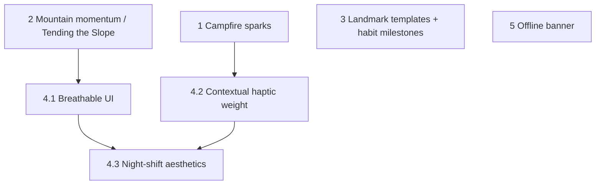

# Phase 3 Implementation Plan (P2)

**Scope:** Elite polish — campfire sparks (EaseOut curve), mountain momentum / Tending the Slope, landmark templates and habit streak milestones, micro-interactions (breathable UI, contextual haptic weight, night-shift), and offline banner when applicable.  
**Source:** [FEATURE_RECOMMENDATIONS_GAMIFIED_EXPERIENCE.md](FEATURE_RECOMMENDATIONS_GAMIFIED_EXPERIENCE.md) P2; §1.1 (mountain momentum), §1.2 (sparks), §1.3 (habit milestones), §2.3 (templates), §3.6 (micro-interactions), §3.2 (offline).

**Prerequisite:** Phase 1 (P0) and Phase 2 (P1) complete — Climb/Edit flows, loading/error/haptics, streaks, Elias context-aware, Whetstone overlay with bubble tail.

**Definition of done for Phase 3:** Campfire sparks scale with burn streak (EaseOut); Scroll shows mountain momentum and “Tending the Slope” Elias when a mountain is untouched; optional landmark hints and habit milestones; serif headers breathe on entry; burn haptics vary by milestone (pebble/landmark/mountain); night period tints Whetstone and Refine overlays amber; offline banner appears when offline support is active.

---

## Construction Audit (Phase 3)

When implementing campfire sparks, confirm per [FEATURE_RECOMMENDATIONS_GAMIFIED_EXPERIENCE.md](FEATURE_RECOMMENDATIONS_GAMIFIED_EXPERIENCE.md) “Construction Audit for Cursor”:

| Item | What to verify | Where in Phase 3 |
|------|----------------|------------------|
| **EaseOut curve (sparks)** | `emissionRate` (and/or height) driven by **Curves.easeOut** of streak count — e.g. `Curves.easeOut.transform(streak / 14)`. Reward feels meaningful early (1→3 days) without visual overload at 30 days. | Task 1.1 |

---

## Task order and dependencies

- **1** requires Phase 2 burn streak provider (or “burns this week”) and Hearth/hearth particle rendering.
- **2** requires node/mountain list and burn/completion data to compute “pebbles this week” and “last burn” per mountain.
- **3** is independent (Climb Step 2 hints; Whetstone streak milestones).
- **4.1–4.3** can be parallelized; 4.2 replaces or refines Phase 1 burn haptic with hierarchy-aware pattern.
- **5** applies only when offline support is added (optional / conditional).

---

## 1. Campfire sparks (atmospheric reward)

**Spec:** [FEATURE_RECOMMENDATIONS_GAMIFIED_EXPERIENCE.md](FEATURE_RECOMMENDATIONS_GAMIFIED_EXPERIENCE.md) §1.2.  
**Files:** [lib/features/sanctuary/sanctuary_screen.dart](lib/features/sanctuary/sanctuary_screen.dart) (`_HearthWidget`), burn streak provider (Phase 2), [lib/core/constants/app_colors.dart](lib/core/constants/app_colors.dart).

### 1.1 Sparks driven by burn streak with EaseOut curve

- **Implementation choice:** Add a **new, lightweight CustomPainter layer** (e.g. `HearthSparkPainter`) in the Sanctuary/Hearth area. No heavy particle package. Map `Curves.easeOut.transform(streak / 14)` to emission rate, particle speed, **lifespan**, and optional subtle jitter so the effect stays performant and controllable.
- **Aesthetic note:** Sparks are **tiny, high-contrast gold pixels** (e.g. 1×1 or 2×2) that **drift upward and fade**. Avoid cartoon or chunky particles; keep the look sophisticated ("Estate Luxury") and consistent with Refined Architectural Luxury.
- **Task:** In `_HearthWidget` (or the widget that renders the campfire/hearth), read burn streak (or “burns this week”) from provider. Parameterize particle **emissionRate** and/or **height** (or gravity) by streak. **Construction Audit — EaseOut:** Use `Curves.easeOut.transform(streak / 14)` (or similar divisor) so intensity rises meaningfully at low streaks (1→3 days) and tapers at high streaks (no blinding firestorm at 30 days). Example: `emissionRate = baseRate + (maxRate - baseRate) * Curves.easeOut.transform(streak / 14)`. Use the CustomPainter layer above; no new assets. Effect must stay subtle and on-theme (warm, refined).
- **Visual tip (Gemini):** Don't only increase the number of sparks; **increase their lifespan**. Longer-living sparks that float higher into the "night sky" of the Sanctuary feel more "Elite" than a crowded fire. By Day 7, EaseOut already delivers ~80% of the visual "rise," rewarding the hardest first week.
- **File refs:** [sanctuary_screen.dart](lib/features/sanctuary/sanctuary_screen.dart): `_HearthWidget` — watch `burnStreakProvider` (or equivalent). If particles are drawn in the same file or a child, pass a scalar derived from streak (EaseOut curve). If using a package (e.g. particles or custom painter), set `emissionRate` / gravity / maxHeight / maxLifetime from that scalar. [lib/providers/](lib/providers/) (streak provider from Phase 2).
- **Acceptance criteria:**
  - Higher burn streak (or burns this week) = visibly more or higher-rising sparks (and optionally longer-lived sparks).
  - No new progress bar or numeric display; effect is atmospheric only.
  - Intensity rises at low streaks and tapers at high streaks (EaseOut); no visual overload at long streaks.

---

## 2. Mountain momentum / Tending the Slope

**Spec:** [FEATURE_RECOMMENDATIONS_GAMIFIED_EXPERIENCE.md](FEATURE_RECOMMENDATIONS_GAMIFIED_EXPERIENCE.md) §1.1 P2.  
**Files:** [lib/features/scroll_map/scroll_map_screen.dart](lib/features/scroll_map/scroll_map_screen.dart), [lib/core/content/elias_dialogue.dart](lib/core/content/elias_dialogue.dart), node/mountain providers or repository (burn/completion timestamps).

### 2.1 Momentum stats per mountain

- **Task:** For each mountain on the Scroll, show “X pebbles burned this week” or “Last burn: X days ago” (or similar). Compute from burn/completion data (e.g. node deletions or completion timestamps in the last 7 days). Display as subtitle or small badge on the mountain card/section.
- **File refs:** [scroll_map_screen.dart](lib/features/scroll_map/scroll_map_screen.dart): per-mountain section, read a provider that returns burns-this-week and last-burn-date for that mountain. Data may come from node_repository (e.g. deleted pebbles with timestamps) or a dedicated view/table. Render subtitle next to progress bar or under mountain name.
- **Acceptance criteria:**
  - Each mountain shows a short momentum line (e.g. “3 burned this week” or “Last burn: 2 days ago”). Empty/never burned can show “No burns yet” or omit.

### 2.2 “Tending the Slope” Elias line (untouched mountain)

- **Task:** When a mountain has had no burns (or no activity) for a week, show Elias line: “The weeds are tall on that northern peak, but the earth is still good.” (Vista/sanctuary vibe). Trigger when user views Scroll or taps that mountain; one line or toast, no modal. Add `tendingSlopeUntouched()` (or similar) to Elias dialogue with 1–2 variants.
- **File refs:** [elias_dialogue.dart](lib/core/content/elias_dialogue.dart): add pool. [scroll_map_screen.dart](lib/features/scroll_map/scroll_map_screen.dart): when rendering mountains, if any mountain’s last burn is ≥7 days ago (or no burns ever), show Elias line once per session or when that mountain is focused. Use existing Elias bubble or SnackBar.
- **Acceptance criteria:**
  - Mountain untouched for 7+ days triggers the “weeds / soil” line in context. No guilt phrasing; encourages return. Does not spam on every scroll.

---

## 3. Landmark templates and habit streak milestones

**Spec:** [FEATURE_RECOMMENDATIONS_GAMIFIED_EXPERIENCE.md](FEATURE_RECOMMENDATIONS_GAMIFIED_EXPERIENCE.md) §2.3, §1.3.  
**Files:** [lib/features/scroll_map/climb_flow_overlay.dart](lib/features/scroll_map/climb_flow_overlay.dart) (Step 2: `_Step2Landmarks`), [lib/features/whetstone/whetstone_screen.dart](lib/features/whetstone/whetstone_screen.dart), [lib/core/content/elias_dialogue.dart](lib/core/content/elias_dialogue.dart).

### 3.1 Landmark template hints (Climb Step 2)

- **Task:** In Climb Step 2 (four landmarks), offer optional **template** hints the user can accept or replace, e.g. “Research → Plan → Execute → Review” or similar. Not forced; placeholder or small “Use template” control that fills the four fields with suggested labels. User can edit or clear.
- **File refs:** [climb_flow_overlay.dart](lib/features/scroll_map/climb_flow_overlay.dart) — `_Step2Landmarks`: add optional “Use template” button or dropdown; on tap, set the four landmark text fields to template values. Store 1–2 templates (e.g. Research/Plan/Execute/Review; Discover/Design/Do/Review). No backend change; local only.
- **Acceptance criteria:**
  - User can apply a template to prefill the four landmark names. User can edit or clear; template does not override after first edit.

### 3.2 Habit streak milestones (7 / 30 / 100 days)

- **Task:** When Whetstone streak reaches 7, 30, or 100 days, show a one-time Elias line or toast (e.g. “Seven days. The stone is sharp.”). No modal; brief. Track “last milestone shown” (e.g. 7, 30, or 100) so the same milestone is not shown again. Use existing Whetstone streak from Phase 2.
- **File refs:** [whetstone_screen.dart](lib/features/whetstone/whetstone_screen.dart): when streak value is 7, 30, or 100 and that milestone has not been shown yet, show Elias line or SnackBar once and set flag (e.g. `shared_preferences` or profile: `last_streak_milestone_shown`). [elias_dialogue.dart](lib/core/content/elias_dialogue.dart): add `habitStreakMilestone(int days)` with variants for 7, 30, 100.
- **Acceptance criteria:**
  - Reaching 7-, 30-, or 100-day habit streak triggers one brief celebration (Elias or toast). Each milestone shows at most once per account.

---

## 4. Micro-interactions (§3.6)

**Spec:** [FEATURE_RECOMMENDATIONS_GAMIFIED_EXPERIENCE.md](FEATURE_RECOMMENDATIONS_GAMIFIED_EXPERIENCE.md) §3.6.  
**Files:** [lib/features/scroll_map/scroll_map_screen.dart](lib/features/scroll_map/scroll_map_screen.dart), Climb flow overlay, [lib/features/sanctuary/sanctuary_screen.dart](lib/features/sanctuary/sanctuary_screen.dart), [lib/features/satchel/satchel_screen.dart](lib/features/satchel/satchel_screen.dart), [lib/providers/time_of_day_provider.dart](lib/providers/time_of_day_provider.dart), [lib/core/constants/app_colors.dart](lib/core/constants/app_colors.dart).

### 4.1 Breathable UI (letter-spacing on entry)

- **Task:** On screen entry, serif headers (“THE SCROLL,” section titles like landmark/peak names) animate **letter-spacing** from condensed (e.g. `0.0`) to expanded (e.g. `1.5`) over **800ms**. Easing: `Curves.easeOutCubic` or similar. Apply only to primary serif headers on Scroll Map and Climb flow overlay; one-shot per entry, no loop.
- **Implementation tip (Gemini):** Animating letter-spacing can cause **text jitter** or layout shifts in standard Flutter `Text` as the bounding box recalculates. Use **flutter_animate** if already in use, and ensure the header has a **fixed width** or **Center** alignment so that as the letters breathe outward, the word **expands from the center** and does not jump left or right.
- **File refs:** [scroll_map_screen.dart](lib/features/scroll_map/scroll_map_screen.dart): wrap header `Text` in `TweenAnimationBuilder` (or `flutter_animate`) with `letterSpacing: Tween<double>(begin: 0.0, end: 1.5)`, duration 800ms, `Curves.easeOutCubic`; use `Center` or fixed-width container. [climb_flow_overlay.dart](lib/features/scroll_map/climb_flow_overlay.dart): same for step titles (Step 1 peak prompt, Step 2 landmarks prompt, Step 3 pebbles prompt). Ensure `TextStyle` supports `letterSpacing`.
- **Acceptance criteria:**
  - Opening Scroll or a Climb step animates serif header letter-spacing 0.0 → 1.5 over ~800ms. Animation runs once per entry; subtle and not distracting. No horizontal jump or jitter; expansion reads as centered.

### 4.2 Contextual haptic weight (pebble / landmark / mountain)

- **Task:** In the Hearth burn flow, set haptic by **completion scope**: (1) **Pebble only** (other pebbles remain on the boulder): `HapticFeedback.lightImpact()` — single tap. (2) **Last pebble of a landmark** (boulder complete): **medium double-tap** — two `mediumImpact()` calls with ~80–120ms delay (sensory metaphor: "splitting a larger stone"). (3) **Last pebble of the mountain** (mountain summit): **heavy long pulse** — `HapticFeedback.heavyImpact()` or sustained pattern. Pass the dropped node and its hierarchy (pebble vs. last-in-boulder vs. last-in-mountain) from the burn handler to choose the pattern.
- **Precision tip (Gemini):** For **Mountain Summit** (Heavy Long Pulse), on **iOS** consider `HapticFeedback.vibrate()` (or a sustained pattern) for a slightly **longer duration** than `heavyImpact()` so it feels like the mountain has actually **settled into the earth**. The medium double-tap for landmark completion is the most underrated part of the hierarchy — keep it distinct.
- **File refs:** [sanctuary_screen.dart](lib/features/sanctuary/sanctuary_screen.dart): `_HearthWidget` `onAcceptWithDetails` — before or after `burnPebble`, determine if the pebble was last in its boulder and last in its mountain (query node list for that mountain or use existing helpers). Call light / medium×2 / heavy (or longer pulse on iOS for summit) accordingly. [lib/providers/satchel_provider.dart](lib/providers/satchel_provider.dart) or node_provider: may need to expose “is last pebble of boulder/mountain” for the dropped node.
- **Acceptance criteria:**
  - Pebble-only burn = light single tap. Last pebble of landmark = medium double-tap. Last pebble of mountain = heavy/long pulse (longer on iOS for "mountain settled" feel). Pack and habit keep existing light feedback; no change for non-burn actions.

### 4.3 Night-shift aesthetics (candlelight tint)

- **Task:** When **time-of-day** is **Night** (`ScenePeriod.night`, 20:00–04:59 per [lib/core/enums/day_period.dart](lib/core/enums/day_period.dart)), apply a **warmer, amber-tinted** treatment: (1) **Whetstone choice overlay** (from Satchel): Elias bubble and backdrop get a soft amber glow. (2) **Refine mode parchment** (Scroll/Edit overlay): background uses a warmer, amber-tinted hue (candlelight). Read `timeOfDayProvider`; when period is `ScenePeriod.night`, apply the tint. Day/Midday/Sunset unchanged; contrast must still meet WCAG.
- **Implementation tip (Gemini):** Instead of a simple amber `ColorFilter`, use a **BackdropFilter** with a very **low-opacity** amber, e.g. `Color(0x15FFB300)`. This creates a **glow** that feels like candlelight reflecting off parchment rather than a flat digital filter, and preserves the “Refined Architectural Luxury” / Coastal Modern (Vista) aesthetic.
- **File refs:** [lib/providers/time_of_day_provider.dart](lib/providers/time_of_day_provider.dart): `timeOfDayProvider` returns `ScenePeriod`. [lib/core/constants/app_colors.dart](lib/core/constants/app_colors.dart): add `candlelightTint` or `nightParchment` (e.g. `Color(0x15FFB300)`) if desired. [lib/features/satchel/whetstone_choice_overlay.dart](lib/features/satchel/whetstone_choice_overlay.dart): when Night, wrap with `BackdropFilter` + low-opacity amber overlay (or `ColorFiltered` with soft blend). **Edit overlay** (Phase 1 task 2.2): when implemented, apply same night tint to Refine/Edit overlay parchment — location TBD (scroll_map_screen or dedicated edit overlay widget).
- **Acceptance criteria:**
  - In Night period, Whetstone choice overlay has visible warm/amber **glow** (candlelight-on-parchment feel). Refine mode parchment is warmer than in Day. Dawn/Midday/Sunset unchanged. Tint is subtle; text contrast remains accessible (WCAG).

---

## 5. Offline banner

**Spec:** [FEATURE_RECOMMENDATIONS_GAMIFIED_EXPERIENCE.md](FEATURE_RECOMMENDATIONS_GAMIFIED_EXPERIENCE.md) §3.2, §6 P2.  
**Files:** Root layout (e.g. [lib/app.dart](lib/app.dart) or main scaffold), connectivity or offline state (if implemented).

### 5.1 Offline banner (when offline support exists)

- **Task:** **Only when** the app has offline support (e.g. Phase 13 or later): when the device is offline, show a clear banner (e.g. at top or bottom): “Offline — changes will sync when you’re back.” Non-blocking; allow use of the app. Hide when back online. If offline support is not yet implemented, skip this task or stub (no-op).
- **File refs:** If an offline/connectivity provider or service exists, watch it and show a `Banner` or `SnackBar`-persistent strip when offline. [app.dart](lib/app.dart) or root scaffold: conditional banner child. If no offline layer exists, document “Deferred until offline support added.”
- **Acceptance criteria:**
  - When offline support is active and device is offline, user sees the offline banner. When back online, banner disappears. If offline support is not in scope, task is skipped or stubbed.

---

## Open decisions

| Decision | Options | Recommendation |
|----------|---------|-----------------|
| Spark particle source | Existing Hearth asset vs custom particle widget | **CustomPainter layer** (e.g. `HearthSparkPainter`); no new package. Aesthetic: small gold pixels, upward drift, fade. |
| Mountain momentum data | Derived from node deletes vs dedicated completions table | Prefer deriving from existing burn/delete timestamps; add table only if query cost or schema is an issue. |
| Night tint intensity | Subtle vs noticeable | Prefer subtle (low opacity) so Day/Night difference is clear but not harsh. |
| Offline support timeline | Phase 13 vs later | Phase 3 plan treats offline banner as conditional; implement when offline is added. |

---

## Phase 3 sign-off

- [ ] 1.1: Campfire sparks driven by burn streak with EaseOut curve; no progress bar; atmospheric only.
- [ ] 2.1–2.2: Mountain momentum stats on Scroll; “Tending the Slope” Elias when mountain untouched 7+ days.
- [ ] 3.1–3.2: Optional landmark template in Climb Step 2; habit streak milestones (7/30/100) with one-time Elias/toast.
- [ ] 4.1–4.3: Breathable UI (serif header letter-spacing 800ms); contextual haptic (light / medium double / heavy); night-shift (amber tint on Whetstone overlay and Refine parchment).
- [x] 5.1: Offline banner — **Deferred** until offline support is added (no connectivity provider in scope).

When all boxes are checked (or 5.1 explicitly deferred), Phase 3 is complete and the gamified experience from the Feature Recommendations doc is fully implemented.
